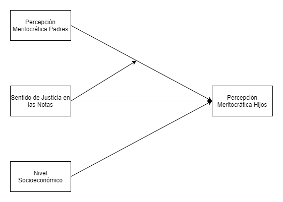
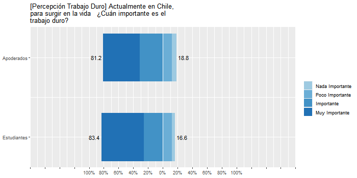
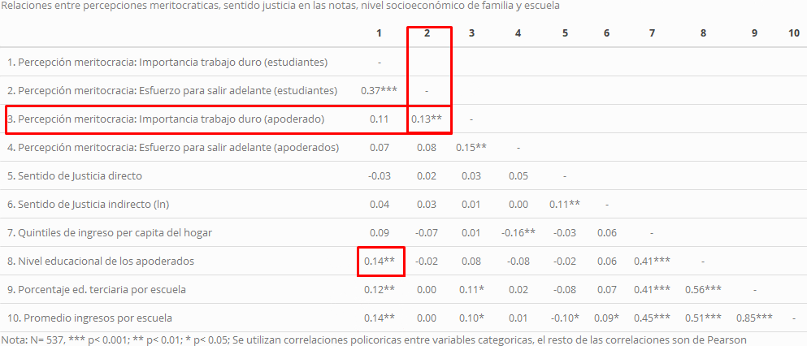
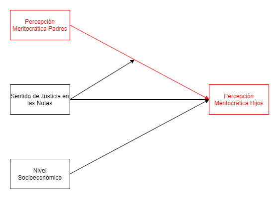
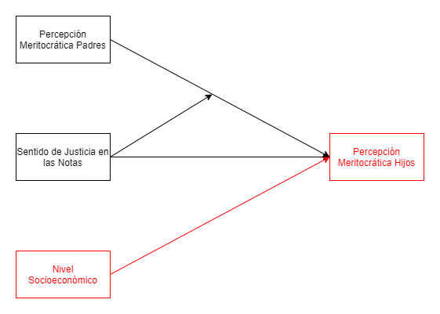
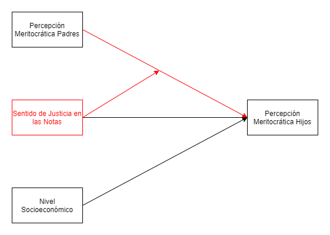
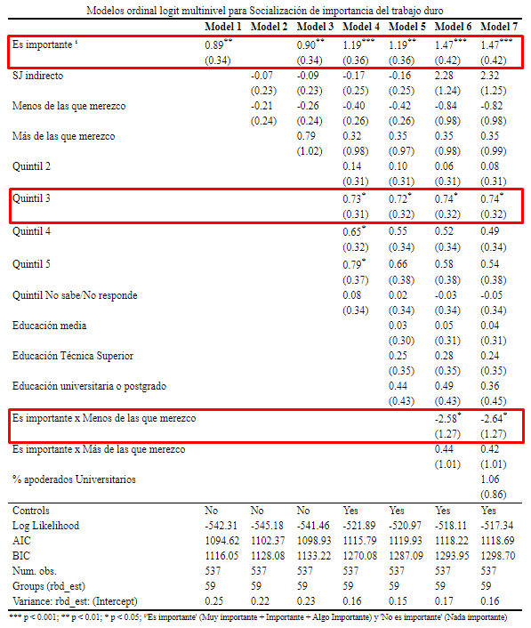

layout: true
class: animated, fadeIn

```{r xaringanExtra, echo = FALSE}
library("xaringanExtra")
  xaringanExtra::use_progress_bar(color = "red", location = "bottom")
```

```{r setup, include=FALSE,eval=TRUE}
options(htmltools.dir.version = FALSE)
```

```{r xaringan-themer, include=FALSE, warning=FALSE}
library(xaringanthemer)
```

```{r cache=FALSE, include=FALSE}
library(RefManageR)
bibobject <- BibOptions(check.entries = FALSE,
           hyperlink = FALSE,
           dashed = FALSE)

BibOptions(bibobject)

myBib <- ReadBib("input/bib/Educación-ciudadana-PACES.bib", check = FALSE)
```


---
class: inverse, right, middle

# Socialización de la meritocracia: el rol de la familia y la escuela. <br>

.medium[.orange[**Juan Carlos Castillo (juancastillov@uchile.cl),  Julio Iturra, Francisco Meneses y Martín Venegas**]]


.small[Departamento de Sociología, Universidad de Chile] <br> 
.small[Centro de Estudios de Conflicto y Cohesión Social - [.orange[COES]]()] <br> 
.small[Proyecto FONDECYT 1181239 (2018-2021)]


***
.medium[[.orange[_VI Seminario Internacional Desigualdad y Movilidad Social **(DEMOSAL)**_]](https://github.com/formacionciudadana)]<br>
.medium[Noviembre, 2021]


---
class: inverse, right, middle

# .bolder[Contenidos]

<br>
###1- Contexto

###2- Antecedentes e hipótesis

###3- Datos, variables y método

###4- Resultados

###5- Discusión y conclusiones
---
class: inverse, right, middle

# .bolder[Contenidos]

<br>
### .red[1- Contexto]

###2- Antecedentes e hipótesis

###3- Datos, variables y método

###4- Resultados

###5- Discusión y conclusiones

---
## Proyecto FONDECYT 1181239 (2018-2021)

.pull-left[
- **Socialización política y experiencia escolar: El rol de la familia y la escuela** 
- Investigador principal: Cristián Cox 
- Estudio Panel Ciudadanía Escolar .red[**PACES**] 
- Actualmente realizado estudios de primera ola y levantando segunda
]

.pull-right[

<br><br>

.center[ 

 ]
 

]


---
class: inverse, right, middle

# .bolder[Contenidos]

<br>
###1- Contexto

###2- .red[Antecedentes e hipótesis]

###3- Datos, variables y método

###4- Resultados

###5- Discusión y conclusiones


---
# Este estudio

### .red[Objeto de investigación]: percepciones meritocráticas de estudiantes secundarios

### .red[Factores explicativos]:

a. Percepciones meritocráticas parentales

b. Experiencias escolares de justicia distributiva

c. Nivel socioeconómico


---
# Meritocracia

* .small[Ideal que aspira a que los recursos se distribuyan según el esfuerzo y talento personal (Young, 2006)]

### Posibles implicancias en población adulta

* .small[Justificación o legitimación de las desigualdades socioeconómicas (Evans et al., 2010; Castillo, 2011)]

### Posibles implicancias en jóvenes:

* .small[Fomento de valores antidemocráticos, como intolerancia o autoritarismo (contrarios al ideal solidario de formación ciudadana) (e.g. Azevedo et al., 2019; Madeira et al., 2019).]
* .small[Creer en el ideal meritocrático puede llevar a responsabilizarse por bajo desempeño escolar (Major et al., 2017).]
---
# Problematización

- Reciente alza en los estudios sobre meritocracia
- Evidencia sobre la importancia de la meritocracia en las vivencias juveniles de la desigualdad
- **Poca atención en la formación de estas creencias en etapas tempranas**
- Estudios existentes abordan perspectiva macro

### Propuesta

* Socialización política: el rol de la familia y la escuela
* Justicia distributiva: el rol de las experiencias de injusticia y el nivel socioeconómico

---
## Conceptos principales

### Percepciones meritocráticas

* La convicción de los sujetos sobre que su sociedad realmente distribuye recursos según el mérito individual (Castillo et al., 2019)

### Sentido de justicia en las notas (escuela)

* Evaluaciones de justicia en la distribución de notas en la escuela (subrecompensado, justo, sobrerecompensado) (Resh, 2010)

### Nivel socioeconómico (familia)

* Posición en la estructura social, cantidad de recursos.

---


## Hipótesis de socialización

Padres con mayor nivel de percepción de meritocracia estarán asociados a hijos con similares percepciones.

## Hipótesis de justicia en la escuela

Estudiantes con una mayor sensación de justicia en sus notas percibirán mayor meritocracia


---

## Hipótesis NSE

El estatus socioeconómico de la familia posee un efecto positivo sobre las percepciones meritocráticas del estudiante.

## Hipótesis de interacción

La relación entre percepción meritocrática de los padres y de los hijos será más positiva para aquellos que experimentan un mayor sentido de justicia en la escuela

---
# Modelo teórico

.center[]

---
class: inverse, right, middle

# .bolder[Contenidos]

<br>
###1- Contexto

###2- Antecedentes e hipótesis

### .red[3- Datos, variables y método]

###4- Resultados

###5- Discusión y conclusiones


---
# Datos

- Panel de Ciudadanía Escolar (PACES): Estudio longitudinal con muestra representativa de estudiantes de segundo medio, apoderados y profesores en la Región Metropolitana y las comunas de Antofagasta, Calama, Talca, Curicó y Linares.

- Muestra original: 1635 estudiantes, 744 apoderados en 64 escuelas.

- Muestra para este estudio (transversal): 537 estudiantes y apoderados en 59 escuelas

---
# Variables


**Percepciones meritocráticas** (estudiantes y apoderados)

* _En Chile, los que se esfuerzan salen adelante. Likert 4 categorías grado de acuerdo_
* _Actualmente en Chile, para surgir en la vida ¿Cuán importante es el trabajo duro? Idem grado importancia_

**Sentido de justicia en las notas**

* Directo: _Tomando en cuenta el tiempo que le dedico a mis estudios, las notas que me saco son. . . Más/Menos las que merezco_
* Indirecto: Formula Jasso (1978) con notas


**Nivel socioeconómico**:  Nivel educativo, Quintiles de ingreso

---
# Métodos

- Análisis descriptivo: frecuencias y correlaciones de Pearson y Policóricas

- Análisis multivariado: regresiones ordinales logísticas multinivel (intercepto y pendiente aleatoria)

.center[
$\text{merit}_{est}= \text{merit}_{apod} + \text{sjusticia}_{est} + \text{NSE}_{familia}  ~~~~~~~~~~(1)$

$\text{merit}_{est}= \text{merit}_{apod} \times \text{sjusticia}_{est} + \text{NSE}_{familia}~~~~~~~~~~(2)$ 
]

---
class: inverse, right, middle

# .bolder[Contenidos]

<br>
###1- Contexto

###2- Antecedentes e hipótesis

###3- Datos, variables y método

###  .red[4- Resultados]

###5- Discusión y conclusiones


---
class: center, middle




---
class: middle



---
### .red[Modelo Teórico]
.center[]

---

### .red[Hipótesis de socialización]
.center[]

---
### .red[Hipótesis de nivel socioeconómico]
.center[]

---

### .red[Hipótesis de interacción]
.center[]

---
class: inverse, right, middle

# .bolder[Contenidos]

<br>
###1- Contexto

###2- Antecedentes e hipótesis

### 3- Datos, variables y método

###4- Resultados

### .red[5- Discusión y conclusiones]

---
# Resumen resultados preliminares

- .large[El nivel socioeconómico de la familia está relacionado positivamente con las percepciones meritocráticas (trabajo duro) de los hijos.]

- .large[Percepciones meritocráticas (trabajo duro) de apoderados están relacionadas positivamente con las de sus hijos]

- .large[Las experiencias de injusticia en las notas (directo) mitigan la relación positiva entre percepciones meritocráticas (trabajo duro) padres-hijos.]


---
# Futuras investigaciones

- .large[Más estudios que indaguen la dimensión subjetiva de la desigualdad en jóvenes desde la socialización, especialmente de agentes como la familia y escuela]

- .large[Avanzar en la agenda de justicia en la escuela tomando en cuenta otros indicadores de desigualdad subjetiva y profundizando en la medición de variables]

- .large[Vínculo meritocracia y ciudadanía]

---
class: inverse, center, middle

# ¡Muchas gracias!


---
## Referencias

.medium[Azevedo, F., Jost, J.T., Rothmund, T. & Sterling, J. (2019). Neoliberal Ideology and the Justification of Inequality in Capitalist Societies: Why Social and Economic Dimensions of Ideology Are Intertwined: Neoliberal Ideology and Justification. Journal of Social Issues 75 (1): 49–88. https://doi.org/10.1111/josi.12310.] 

.medium[Castillo, J.C., Torres, A., Atria, J. & Maldonado, L. (2019). Meritocracia y Desigualdad Económica: Percepciones, Preferencias e Implicancias. Revista Internacional de Sociología 77 (1): 117. https://doi.org/10.3989/ris.2019.77.1.17. 114.]

.medium[Castillo, J.C. (2011). Legitimacy of Inequality in a Highly Unequal Context: Evidence from the Chilean Case. Social Justice Research 24 (4): 314–40. https://doi.org/10.1007/s11211-011-0144-5]


---
## Referencias

.medium[Evans, M. D. R., Kelley, J., & Peoples, C.D. (2010). Justifications of Inequality: The Normative Basis of Pay Differentials in 31 Nations. Social Science Quarterly 91 (5): 1405–31]

.medium[Jasso, G. (1978). On the Justice of Earnings: A New Specification of the Justice Evaluation Function. American Journal ofSociology 83 (6): 1398–1419. https://doi.org/10.1086/226706.]

.medium[Major, B., Kaiser, C.R, O’Brien, L.T, & McCoy, S.H. (2007). Perceived Discrimination as Worldview Threat or Worldview Confirmation: Implications for Self-Esteem. Journal of Personality and Social Psychology 92 (6): 1068–86. https://doi.org/10.1037/0022-3514.92.6.1068. ]


---
## Referencias 

.medium[Madeira, A.F., Costa-Lopes, T., Dovidio, J.F., Freitas, G., & Mascarenhas, M.F. (2019). Primes and Consequences: A Systematic Review of Meritocracy in Intergroup Relations. Frontiers in Psychology 10 (September). https://doi.org/10.3389/fpsyg.2019.02007.] 

.medium[Resh, N. (2010). Sense of Justice about Grades in School: Is It Stratified Like Academic Achievement? Social Psychology of Education 13 (3): 313–29. https://doi.org/10.1007/s11218-010-9117-z.]

.medium[Young, M. (2006). The Rise of Meritocracy. Oxford, UK ; Malden, MA: Blackwell Pub. in association with The Political Quarterly]

---
.center[]
---
class: inverse, right, middle

# Socialización de la meritocracia: el rol de la familia y la escuela. <br>

.medium[**Juan Carlos Castillo (juancastillov@uchile.cl),  Julio Iturra, Francisco Meneses y Martín Venegas**]

Departamento de Sociología, Universidad de Chile <br>
Centro de Estudios de Conflicto y Cohesión Social - [COES]()<br>
Proyecto FONDECYT 1181239 (2018-2021)

***
[_VI Seminario Internacional Desigualdad y Movilidad Social **(DEMOSAL)**_]()

Noviembre, 2021
