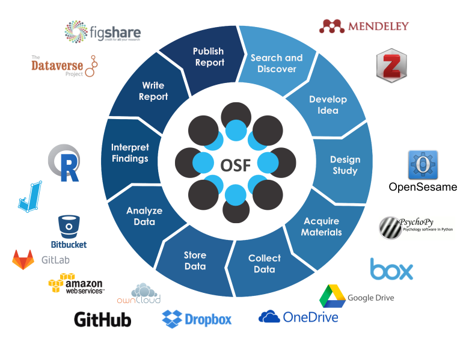
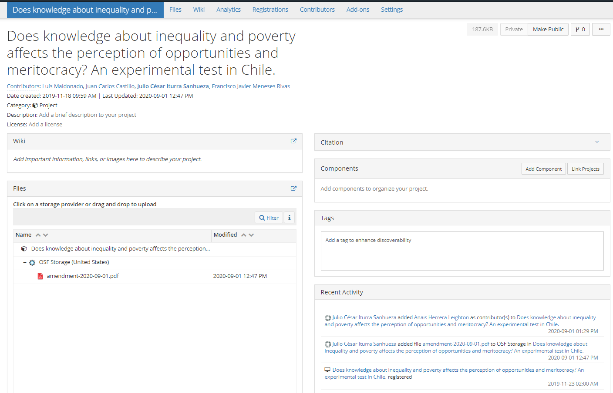
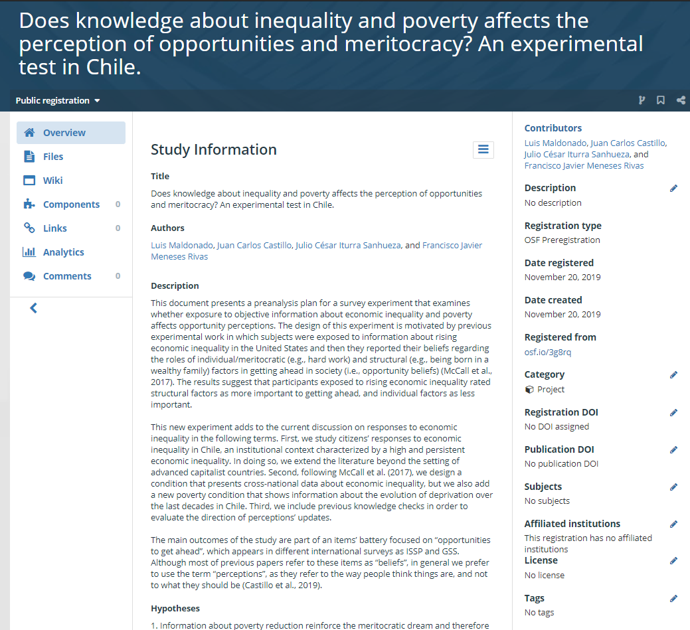

layout: true
class: animated, fadeIn

---
class: inverse, left, middle

# _Elementos para la transparencia de proyectos de investigación   .small[]_

***
[FONDECYT Regular 1181239](https://github.com/formacionciudadana)

 

####Noviembre, 2020

---
class: center, middle

# _Transparencia, Apertura y Reproducibilidad_

---

.left-column[

Teniendo presente las particularidades de cada disciplina, existen puntos en común desde donde es factible llevar a cabo el principio de Apertura, estos son los estándares de Diseño de Estudio, Materiales de trabajo, Disponibilidad de datos y Análisis (Nosek et al., 2015).
]

.right-column[
   

]

---
# Open Science Framework

.left-column[]

.right-column[

> El **Open Science Framework** (en adelante OSF) es una plataforma de gestión de proyectos gratuito y abierto que facilita la colaboración a las y los investigadores a lo largo de todo el ciclo de investigación.

]

---

En este marco, las características más relevantes del OSF son:

* **Estructura de proyectos:** Gestión centralizada de archivos, datos, código e información relevante para el proyecto.

* **Acceso Controlado:** Manejo con respecto a qué partes del proyecto son públicas o privadas, lo que facilita colaborar y compartir con el equipo de trabajo o Comunidad científica en general.

* **Flujo de trabajo eficiente:** Control de versiones automatizado, identificadores para proyectos y materiales, pre-registro de estudios, generador de pre-prints (**SocArxiv**) e integración con otras plataformas de gestión de datos e información.

* **Repositorio confiable:** Los fondos de preservación del OSF garantizan un acceso libre que se estima en unos 50 años aproximadamente.

---
class: center

---
class: center

[https://osf.io/3tewb](https://osf.io/3tewb)

---
# Pre-prints: SocArxiv

.left-column[  ]

.right-column[ 
> **SocArxiv** es un servidor de preimpresión (pre-prints) de acceso abierto para las ciencias sociales. Los artículos pueden ser enviados de forma gratuita; Todos los artículos publicados pueden ser descargados gratuitamente. Las discipinas asociadas son **Antropología, Arqueología, Economía, Lingüística, Ciencias políticas, Estudios religiosos, Sociología**]

---

## Temas

* Por equipo: proceso de definición de conceptos 

## Planificación

* Diciembre: preparación y exploración de datos
* Enero: Resultados preliminares
* Marzo: Producto "borrador" final.

---

class: middle, center

# `r  fontawesome::fa(name = "github", fill = "black")`   [github.com/formacionciudadana](https://github.com/formacionciudadana)

