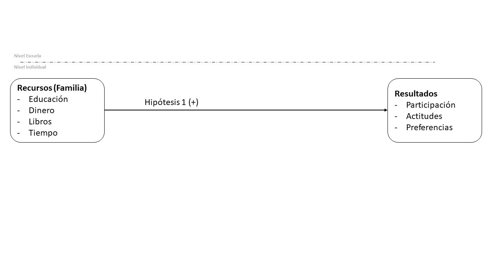
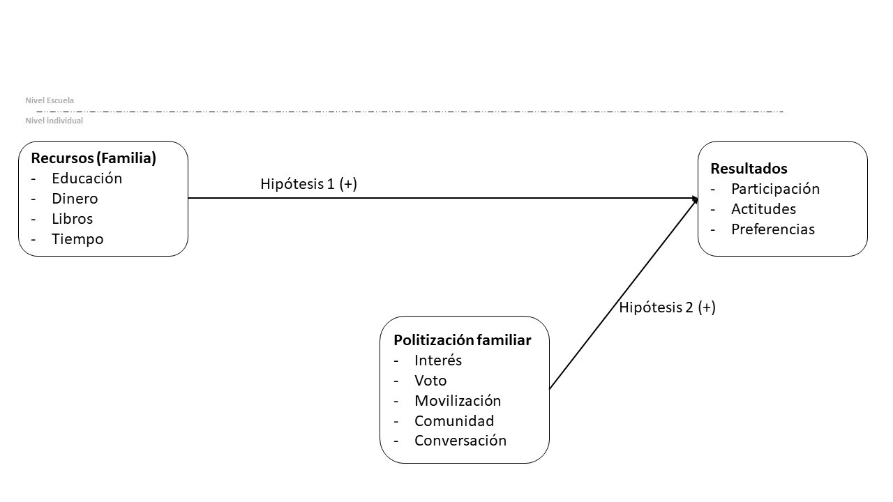
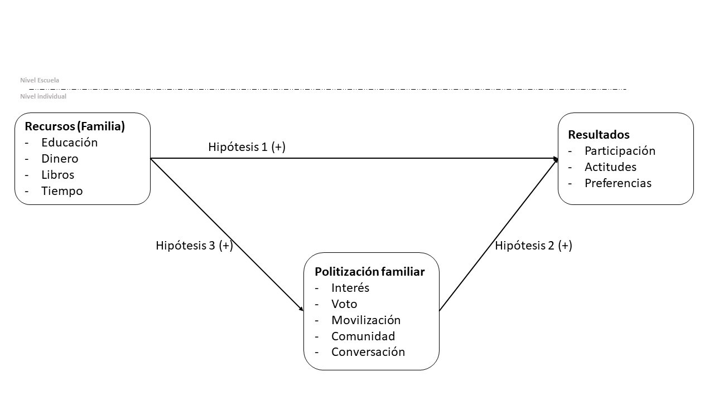
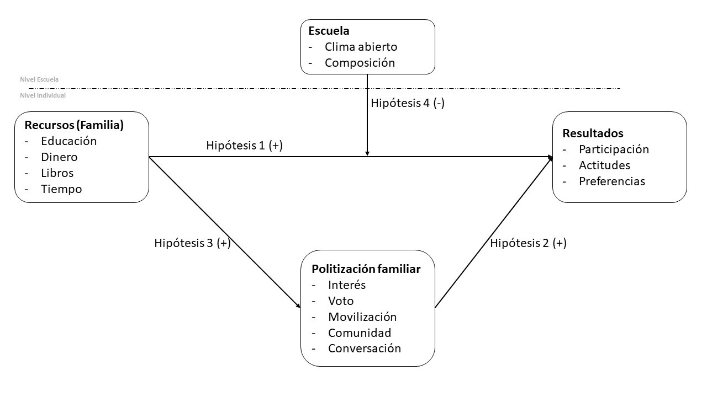
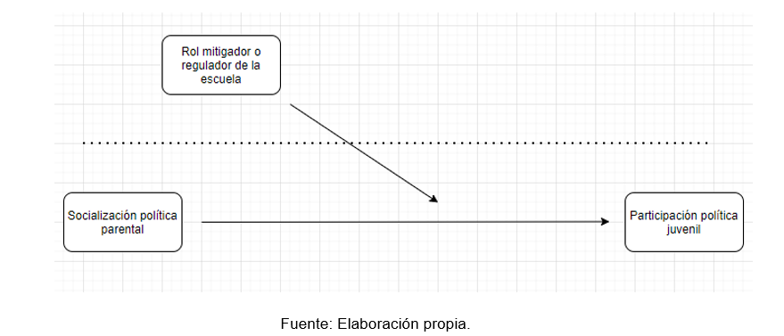
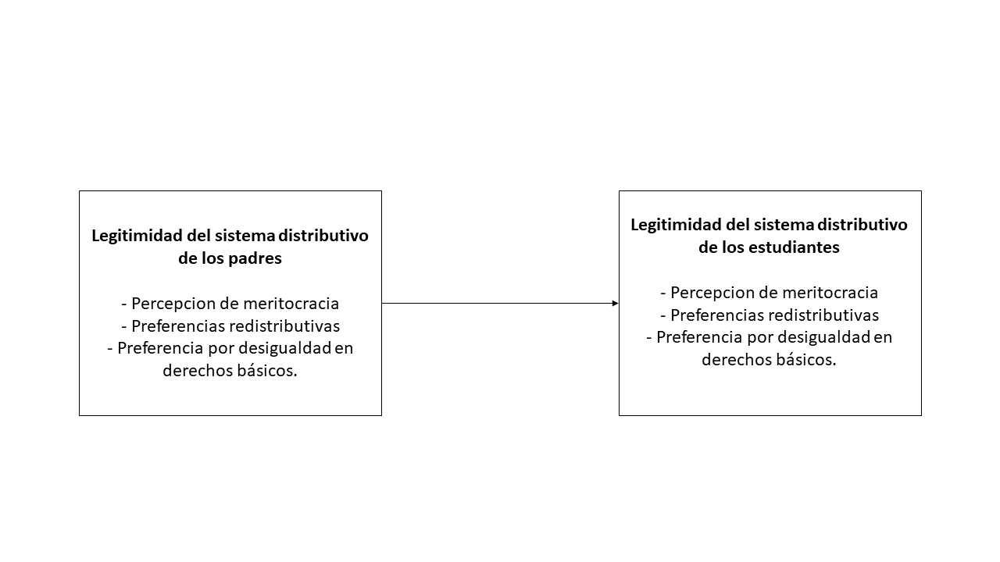
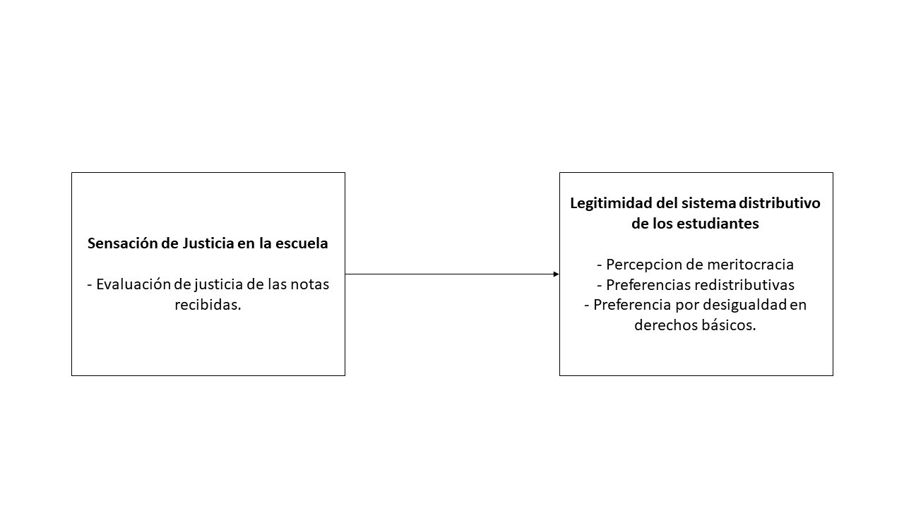
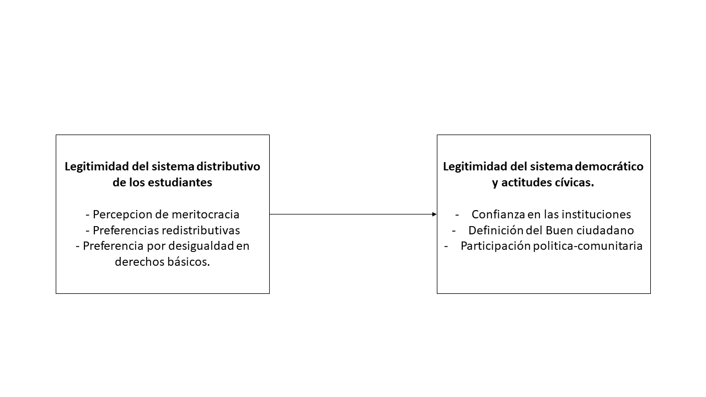
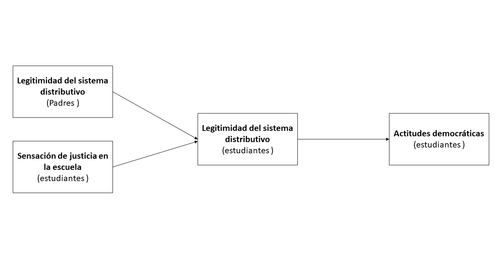
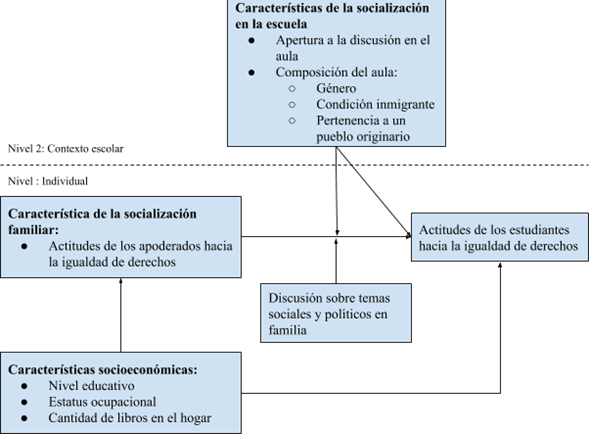

layout: true
class: animated, fadeIn

---
class: inverse, left, middle

# _Socialización política y educación para la ciudadanía el rol de la  familia y de la escuela.   .small[Avances de grupos de trabajo]_

***
[FONDECYT Regular 1181239](https://github.com/formacionciudadana)

 

####Octubre, 2020

---
class: center, middle

# _Grupos de trabajo_

---
### 1. Participación política

Daniel Miranda, Brian Montenegro y Karen Tapia 

### 2. Legitimidad democrática

Juan Carlos Castillo, Francisco Meneses y Martín Venegas

### 3. Tolerancia

Daniel Miranda, Anais Herrera y Kevin Carrasco

 

_**Coordinación:**_ Julo Iturra 

---
class:middle, center

***
# Socialización Política: elementos centrales
***
---

### Supuesto: las actitudes e involucramiento político observado en adultos tiene sus raíces en las experiencias a los largo de la vida, incluidas las experiencias tempranas.
### Proceso por medio del cual los individuos encuentran su lugar en la comunidad política vía adquisición de conocimientos, habilidades y actitudes respecto del sistema político (Abendschön, 2013).
### ¿Quién aprende qué, de quién, bajo que circunstancias, con que efectos? (Greenstein, 1965).
---
# Conceptos Clave
### Transmisión intergeneracional del desigualdad política
#### ¿Cómo las condiciones socioeconómicas se traducen en ventajas/desventajas sociopolíticas?
### Transmisión intergeneracional
#### (Dis)similaridad de comportamientos/preferencias entre generaciones
### Compensación o reproducción de la desigualdad política
#### Potencial rol mitigador y/o que contextos como la escuela pueden tener sobre procesos descritos previamente.
---
 
---

---

---

---
class: slideInRight, middle, inverse

***
# Participación política
***
---
# Introducción
### - Conformación del Equipo de Trabajo
### - Lineamientos generales de la investigación
---
# Conceptos Clave
- Participación política (Hartung, 2017; Diemer 2012; Levy & Akiva, 2019; Miranda et al., 2017; Quintelier, 2008; Quintelier, 2011; Quntelier, 2015).

- Socialización política parental (McIntosh et al., 2007; McFarland and Thomas, 2006; Quintelier, 2013; Schlozman et al., 2012; Verba el al., 2003).

- El rol de la escuela (Ascorra, 2016; Hoskins et al., 2011; Hoskins et al., 2016; Muñoz-Tamayo, 2019; Aguilera, 2006, Zarzuri, 2006; Castillo et al., 2014; Navarrete, 2008; Quintelier, 2013; Neundorf, 2016; Hartung, 2017) 
---
class: middle, center

.center[] 

---
# Preguntas de Investigación
##### 1. ¿En qué medida la socialización política parental incide en la participación política de los jóvenes chilenos?
##### 2. ¿En qué medida la socialización política parental incide en la participación política de los jóvenes chilenos de distintos estratos socioeconómicos?
##### 3. ¿Qué papel juega la escuela como mitigador o regulador de las desigualdades de origen en la participación política de los jóvenes chilenos?
---
# Plan de análisis
#### - Etapa inicial: operacionalización de los conceptos de participación, familia y escuela.
#### - Etapa de análisis descriptivo: construcción de tablas a partir de las variables identificadas en la base de datos de la encuesta PACES.
#### - Etapa de análisis relacional: análisis estadístico de la incidencia de la socialización política en la participación y el rol de la escuela en esa relación.
---
class: slideInRight, middle, inverse

***
# Legitimidad Democrática
***
---

# Problematización: la legitimidad de un sistema distributivo en crisis. 

 * La desigualdad como creciente problema nacional e internacional. Inequidad de oportunidades, discriminación y cohesión: Un objetivo de los ODS.

 * Individuo racional y economía moral de la desigualdad: El merito como criterio distributivo legitimador. 

 * Los estudios se han centrado en las características individuales y nacionales relacionadas con la legitimidad del sistema distributivo (Immergut and Schneider, 2020; Solt et al. 2016)
	* Proponemos avanzar en la comprensión del efecto de la socialización familiar y escolar en la legitimidad de la desigualdad (Le Garrec, 2015). 

---

# Marco conceptual 

* Legitimidad del sistema distributivo (Kluegel y Smith, 1981)
    + Percepcion meritocratica 
    + Preferencias redistributivas
    + Preferencias adscriptivistas. 
* Agentes de socialización politica (Wanders et al., 2020; Astill et al., 2002)
	  + Transmisión de valores, percepciones y.... ¿Evaluación de justicia? 
* Sensación de justicia en la escuela (Jasso y Resh, 2002; Resh y Sabbagh, 2016) 
    + Evaluación de justicia en las notas
    + Justicia interaccional. 
    + Justicia procesal.
* Actitudes relacionadas con la democracia. (Abdelzadeh, 2015; Segovia, 2008)  
    + Definición de un Buen ciudadano.
    + Confianza en las instituciones.
    + Participación política.
---

## H 1-2 Justicia distributiva y socialización

.center[]

* En términos generales, el sistema distributivo posee una baja legitimidad en los estudiantes chilenos (Descriptivo).
* La baja legitimidad del sistema distributivo se relaciona con poseer padres que consideren poco legitimo dicho sistema. 

---
### H3 Sentido de injusticia y sistema distributivo

.center[]

 * Una evaluación de injusticia en las notas se relaciona con una menor legitimidad del sistema distributivo en general.

---
### H 4-6 Sistema Distributivo y democracia 
.center[]

 * Una baja justificación de la desigualdad del sistema distributivo se relaciona con una menor confianza en las instituciones políticas.
 * Una baja justificación de la desigualdad del sistema distributivo se relaciona con una imagen del buen ciudadano basada en la acción más que en la obediencia.
 * Una baja justificación de la desigualdad se relaciona con una mayor participación comunitaria y política. 

---
# Modelo en general. 

.center[]

---
class: slideInRight, middle, inverse

***
# Tolerancia
***
---

# Introducción
*  Si bien hay varias investigaciones sobre las características de los estudiantes que se relacionan con sus actitudes hacia la igualdad de derechos (ej. Torney‐Purta, Wilkenfeld & Barber, 2008; Isac, Maslowski & Werf, 2012; Schulz, Ainley, Cox & Friedman, 2018; Miranda, Castillo & Cumsille, 2018) y sobre las características de la escuela que se relacionan con estas actitudes (ej. Schulz & Ainley, 2018; Maurissen, Barber & Claes, 2020; Torney‐Purta et.al, 2008; Villalobos, Treviño & Wyman, 2018), hay escasa literatura sobre la asociación entre las actitudes de los padres y las actitudes de sus hijos. 

*  De hecho, los artículos relativos a la asociación de las actitudes de los apoderados y sus hijos refieren a actitudes prejuiciosas hacia inmigrantes (Meeusen & Dhont, 2015; Miklikowska, 2016), homosexuales, musulmanes y prejuicios sexistas (Meeusen & Dhont, 2015), actitudes anti inmigrantes (Miklikowska, 2017;  Miklikowska, Bohman & Titzmann, 2019) y actitudes hacia los inmigrantes en términos generales (Miklikowska, 2016). 
---
# Objetivos de investigación

*Objetivo general* 
*  Evaluar si la diversidad en el aula y la apertura a la discusión posee/n la capacidad de disminuir las diferencias en las actitudes hacia la igualdad de derechos de los jóvenes chilenos, producidas por características, prácticas y actitudes de la familia de los estudiantes (más específicamente, las características socioeconómicas, las actitudes de los apoderados hacia la igualdad de derechos y la frecuencia con que discuten sobre temas sociales y políticos).
---
# Objetivos de investigación

*Objetivos específicos*
*  Establecer en qué medida las características socioeconómicas se relacionan con las actitudes de los jóvenes chilenos hacia la igualdad de derechos y con las las actitudes de los apoderados hacia la igualdad de derechos. 
*  Establecer en qué medida las actitudes de los apoderados hacia la igualdad de derechos se relacionan con las actitudes de sus hijos hacia la igualdad de derechos. 
*  Establecer en qué medida la frecuencia con que se discute sobre temas sociales y políticos en familia afecta la relación entre las actitudes de los apoderados hacia la igualdad de derechos y las actitudes de sus hijos hacia la igualdad de derechos. 
*  Establecer en qué medida la diversidad en el aula y la apertura a la discusión se relacionan con las actitudes de los estudiantes hacia la igualdad de derechos. 
*  Identificar el rol de la diversidad en el aula y la apertura a la discusión en la escuela como mitigadores (o no) de la intensidad de la relación entre las actitudes de los apoderados hacia la igualdad de derechos y las actitudes de sus hijos hacia la igualdad de derechos. 
---
# Conceptos Clave

*Características individuales I *

*  **Conocimiento cívico: **influye sobre las actitudes de los estudiantes hacia la igualdad de derechos de inmigrantes (Torney-Purta, Wilkenfeld & Barber, 2008; Isac, Maslowski & van der Werf, 2012; De Groof, Elchardus, Franck & Kavadis, 2008), hacia la igualdad de género y la igualdad de derechos de grupos étnicos y raciales (Schulz & Ainley, 2018) y hacia la igualdad de derechos de personas homosexuales (Schulz, Ainley, Cox & Friedman, 2018; Miranda, Castillo & Cumsille, 2018). 

---
*Características individuales II*

*  **Género:** ser mujer influye positivamente en las actitudes hacia la igualdad de derechos de inmigrantes (Maurissen, Barber & Claes, 2018; Torney-Purta, Wilkenfeld & Barber, 2008; Isac, Maslowski & van der Werf, 2012; Miranda, Castillo & Cumsille, 2018; Farkač, Scott & Šerek, 2020; Michel & Blatter, 2020), hacia minorías étnicas (De Groof, Elchardus, Franck & Kavadis, 2008), hacia la igualdad de género, hacia la igualdad de derechos para todos los grupos étnicos y raciales (Schulz & Ainley, 2018; Miranda, Castillo & Cumsille, 2018) y hacia la igualdad de derechos de personas homosexuales (Schulz, Ainley, Cox & Friedman, 2018; Miranda, Castillo & Cumsille, 2018). 

*  **Condición de inmigración:** Las personas inmigrantes tienden a tener una actitud positiva hacia la igualdad de derechos de inmigrantes (Villalobos, Treviño, Wyman & Béjares, 2018; Miranda, Castillo & Cumsille, 2018), hacia la igualdad de género y hacia la igualdad de derechos de grupos étnicos y raciales (Schulz & Ainley, 2018; Miranda, Castillo & Cumsille, 2018). 

---
# *Características escolares*
*  __Apertura a la discusión en el aula:__influye en las actitudes de los estudiantes hacia la igualdad de derecho de inmigrantes (Isac, Maslowski & van der Werf, 2012; De Groof, Elchardus, Franck & Kavadis, 2008; Torney-Purta, Wilkenfeld & Barber, 2008) y hacia la igualdad de derechos de inmigrantes, grupos étnicos y mujeres (Schulz & Ainley, 2018), mientras que Maurissen, Barber & Claes (2018) plantean que la apertura a la discusión dentro del aula no se asocia significativamente con las actitudes hacia la igualdad de derechos de los inmigrantes.  
*  __Actitudes hacia la igualdad de derechos de los compañeros:__ las actitudes antiinmigrantes de los compañeros en general tendrían un efecto sobre las actitudes antiinmigrantes de los estudiantes (Miklikowska, 2017) y los cambios en estas actitudes antiinmigrantes de los compañeros durante el tiempo también afectan las actitudes de los estudiantes (Miklikowska, Bohman & Titzmann, 2019).
. 
*  __Composición del aula:__ la presencia de estudiantes de diversos orígenes étnicos y/o raciales generarían un mayor apoyo hacia la tolerancia e igualdad de derechos para inmigrantes (Villalobos, Treviño, Wyman & Béjares, 2018; Gorodzeisky, Semyonov, 2009). 
---
# *Características familiaresI *
*  **Antecedentes socioeconómicos:**influyen sobre las actitudes hacia la igualdad de derechos de inmigrantes (Miranda, Castillo & Cumsille, 2018; Villalobos, Treviño, Wyman & Béjares, 2018; Isac, Maslowski & van der Werf, 2012) y sobre los cambios en las actitudes antiinmigrantes de los estudiantes (Miklikowska, 2017) y Schulz & Ainley (2018) señalan que no existe una relación significativa entre estos antecedentes y las actitudes hacia la igualdad de género y hacia los derechos de grupos étnicos. 

*  **Actitudes de los padres hacia la igualdad de derechos:** Miklikowska (2016) señala que las actitudes de los padres logran influir en las actitudes de los hijos al transmitirles parte de sus creencias ante el prejuicio y tolerancia sobre inmigrantes. Miklikowska, Bohman & Titzmann (2019) enfatizan en que los padres afectan la formación de las actitudes antiinmigrantes de los adolescentes a través de la socialización activa a largo plazo y mediante la gestión del mudo social de sus hijos, sentado la base del prejuicio. 

---

# *Características familiares II * 

*  **Frecuencia de discusión sobre temas políticos y sociales:** Meeusen & Dhont (2015) incluyen que la similitud intergeneracional sobre el prejuicio hacia inmigrantes, musulmanes, homosexuales y mujeres está arraigada en las actitudes ideológicas de los padres y que el traspaso de actitudes prejuiciosas y hacia la tolerancia sobre estos grupos se acentúa según la frecuencia de la discusión sobre temas políticos y problemáticas sociales con sus hijos. 
---
# Modelo teórico
.center[]

---
class: middle, center

#`r  fontawesome::fa(name = "github", fill = "black")`   [github.com/formacionciudadana](https://github.com/formacionciudadana)

