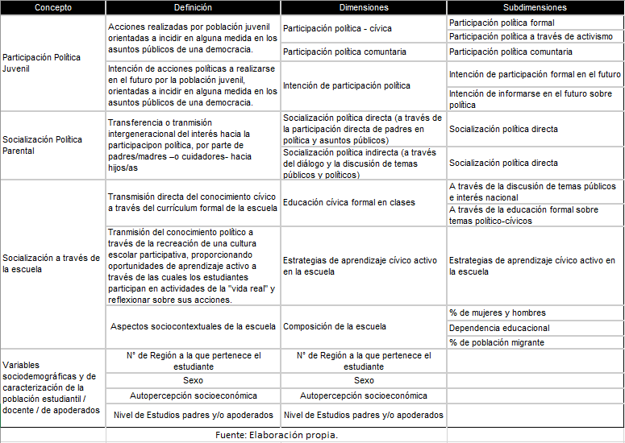
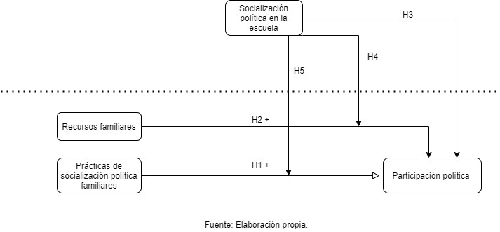

layout: true
class: animated, fadeIn

---
class: inverse, left, middle

# _Socialización política y educación para la ciudadanía el rol de la  familia y de la escuela.   .small[Avances de grupos de trabajo]_

***
[FONDECYT Regular 1181239](https://github.com/formacionciudadana)

 

#### Noviembre, 2020

---
class: center, middle

# _Grupos de trabajo_

---
### 1. Participación política

Daniel Miranda, Brian Montenegro y Karen Tapia 

### 2. Legitimidad democrática

Juan Carlos Castillo, Francisco Meneses y Martín Venegas

### 3. Tolerancia

Daniel Miranda, Anais Herrera y Kevin Carrasco

 

_**Coordinación:**_ Julo Iturra 

---
class: slideInRight, middle, inverse

***
# Participación
***
---
# Conceptos Clave
  - Participación política .
  - Mecanismos formales de participación política y activismo.
  - Participación comunitaria.
  
### Socialización política parental.
 - Socialización directa
 - Socialización indirecta
 - Desigualdad en la transmisión intergeneracional del interés en la política
### El rol de la escuela 
 - Socialización política escolar
 - Educación cívica 
 - Efecto/rol mitigador de la escuela 
---
class: center, middle

---
## Hipótesis

$H_1$ Jóvenes provenientes de familias con mayores niveles de prácticas de socialización política presentarán mayores niveles de participación cívica (intencionada/ reportada) que aquellos jóvenes provenientes de familias con menores niveles de prácticas de socialización política.

$H_{2a}$ Los padres que tienen mayores recursos socioeconómicos y culturales tienen mayores probabilidades de transmitir intergeneracionalmente la participación en la política formal y activista, respecto a aquellos padres que tienen menores recursos socioeconómicos y culturales.

$H_{2b}$ Los padres que tienen mayores recursos socioeconómicos y culturales tienen menores probabilidades de transmitir intergeneracionalmente la participación en política más radical o disruptiva, respecto a aquellos padres que tienen menores recursos socioeconómicos y culturales.
---
## Hipótesis

$H_{3}$. Las variables socio-contextuales de la escuela inciden positivamente en la participación política a futuro de los/as estudiantes.

$H_{4}$ En escuelas donde se realizan mayores prácticas de socialización política se espera que el vínculo de los recursos socioeconómicos y la participación política sea tenue o tienda a desaparecer.

$H_{5}$ La formación cívica en las escuelas compensa las desigualdades de origen de la socialización política familiar.
---
class: center, middle

---
## Preguntas de Investigación
##### 1. ¿En qué medida la socialización política parental incide en la participación política de los jóvenes chilenos?
##### 2. ¿En qué medida la socialización política parental incide en la participación política de los jóvenes chilenos de distintos estratos socioeconómicos y de distintos niveles educativos?
##### 3. ¿Qué papel juega la escuela como mitigador o regulador de las desigualdades de origen en la participación política de los jóvenes chilenos?

---
class: slideInRight, middle, inverse

***
# Legitimidad
***
---
# Problematización: Desigualdad social y democracia:
 * Frente a la baja y desigual participacion democrática han aumentado las investigaciones en formación ciudadana.
 * Pese a que la desigualdad social socava la legitimidad del sistema democrático, no se ha estudiado el efecto de las actitudes hacia la desigualdad sobre la vida cívica.
 * La importancia de la familia: socialización de la desigualdad.
---
# Actitudes cívicas y actitudes hacia la desigualdad.
 * Actitudes cívicas y desigualdad:
	 + Menor confianza en las instituciones
	 + Menor satisfacción con la democracia
	 + Definiciones más activas de ciudadano
	 + Justificación de manifestaciones disruptivas
 * Actitudes hacia la desigualdad y justicia distributiva
  + Percepción de desigualdad.
	+ Redistribución
	+ Igualdad de derechos.
	+ Principios distributivos: Meritocracia.
 * Efectos de la percepción de Meritocracia
  + Autoritarismo social: menos democracia
  + Menor apoyo a la igualdad de derechos
---
## H 1-2 Relación entre actitudes cívicas y actitudes hacia la desigualdad.
.center[]
 * En términos generales, el sistema distributivo posee una baja legitimidad en los estudiantes chilenos (Descriptivo).
 * Existe una relación entre las actitudes hacia la desigualdad económica y las actitudes cívicas en los estudiantes Chilenos.
---
# Aprendiendo sobre desigualdad: socialización de actitudes

* **Punto base:** Las edades tempranas son un momento crucial para formación de actitudes (Martinez y Cumsille, 2015; Ericksson, 1998). Las actitudes desarrolladas tienden a mantenerse hacia la adultez (Mijs, 2018; Alwin y Krosnick, 1991; Sears y Levy, 2003)
  
* **Sobre desigualdad:** Los individuos elaboran modelos explicativos para la desigualdad infiriendo a partir de la información obtenida en su experiencia con instituciones sociales (familia, escuela, barrio etc.) (Mijs, 2018). Información más homogenea implica explicaciones más meritocráticas (Mijs, 2017; Khan, 2010; Gaztambide-Fernández, 2009)
  
* **Brecha:** La literatura empirica sobre actitudes hacia la desigualdad con foco en socialización es escasa, y la existente aborda la socialización en una escala de medida general (e.g Le Garrec, 2015; Ignácz, 2018; VanHeuvelen y Copas, 2018)
---
## Aprendiendo sobre desigualdad: familia y escuela

* Sobre la familia
  + La familia es un primer contexto de socialización que provee valores, expectativas y reglas (Martinez y Cumsille, 2015). Las creencias parentales ejercen una gran influencia en las creencias, actitudes y comportamientos de los niños (Olivos, 2020; Bandura et al. 2001; Frye 2012; Wigfield et al. 2006). Los padres crian a sus hijos a partir de principios basados en su clase social, transmitiendo creencias y actitudes estratificadas (McCory, 2014). 
  
* Sobre la escuela
  + La escuela contribuye a formar la visión de mundo de los estudiantes, en esto, la experiencia de justicia de los estudiantes juega un rol fundamental (Resh y Sabaggh, 2014; 2017). Estudiantes que sienten que la asignación de su nota fue justa, tienden a reportar mayores orientaciones liberales democráticas (Resh y Sabaggh, 2014). Además, los estudiantes tienden a considerar los principios meritocráticos como más adecuados para la distribución de notas (Resh, 2009).
  
---
## $H_{3-4}$
.center[] 

* Padres con actitudes más favorables hacia la desigualdad, fomentarán en sus hijos actitudes más favorables hacia la desigualdad

* Estudiantes que evalúan cómo justa su calificación tendrán actitudes más favorables hacia la desigualdad

---
# Modelo en general.

.center[]

---
class: middle, center

#`r  fontawesome::fa(name = "github", fill = "black")`   [github.com/formacionciudadana](https://github.com/formacionciudadana)

