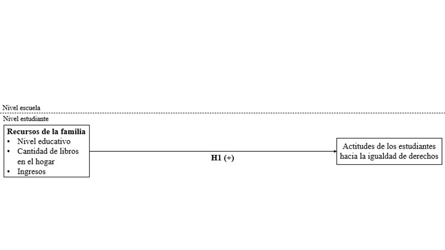
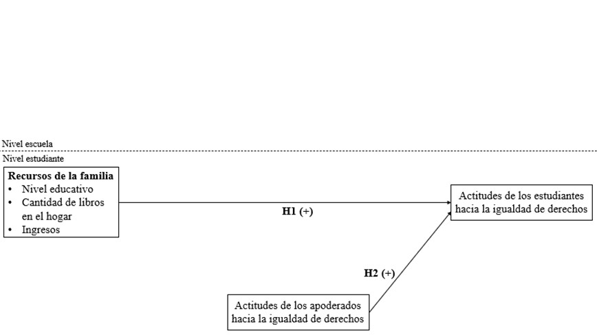
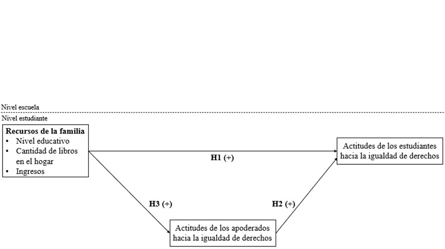
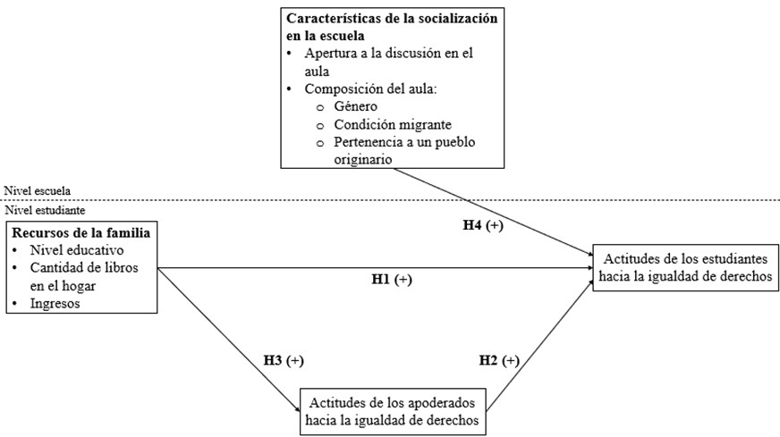
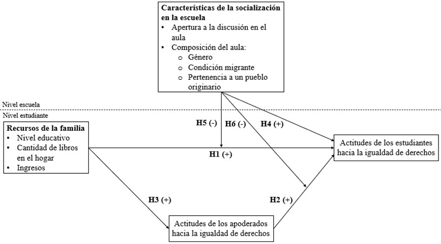

# Introducción
* 
 La igualdad de derechos es un principio básico de toda democracia. No sólo como un imperativo ético, sino que también porque se relaciona íntimamente con las posibilidades de desarrollo social y progreso económico de los países (ONU, 2016; PNUD, 2017) y con la vida democrática, la convivencia y la cohesión social en general (PNUD, 2017).

* 
 La promoción de políticas públicas que se orienten a garantizar la igualdad dependerá, en buena medida, de la existencia de una opinión pública favorable a la promoción y garantía de los derechos de todas las personas. 

* 
 Según la UNESCO esta “(...) actitud activa de reconocimiento de los derechos humanos universales y las libertades fundamentales de los demás” (1995, p.79) puede ser denominada como tolerancia. 

---

# Introducción
* 
 Si bien hay varias investigaciones sobre las características de los estudiantes que se relacionan con sus actitudes hacia la igualdad de derechos (ej. Torney‐Purta, Wilkenfeld & Barber, 2008; Isac, Maslowski & Werf, 2012; Schulz, Ainley, Cox & Friedman, 2018; Miranda, Castillo & Cumsille, 2018) y sobre las características de la escuela que se relacionan con estas actitudes (ej. Schulz & Ainley, 2018; Maurissen, Barber & Claes, 2020; Torney‐Purta et.al, 2008; Villalobos, Treviño & Wyman, 2018), hay escasa literatura sobre la asociación entre las actitudes de los padres y las actitudes de sus hijos. 

* 
 De hecho, los artículos relativos a la asociación de las actitudes de los apoderados y sus hijos refieren a actitudes prejuiciosas hacia inmigrantes (Meeusen & Dhont, 2015; Miklikowska, 2016), homosexuales, musulmanes y prejuicios sexistas (Meeusen & Dhont, 2015), actitudes anti inmigrantes (Miklikowska, 2017;  Miklikowska, Bohman & Titzmann, 2019) y actitudes hacia los inmigrantes en términos generales (Miklikowska, 2016). 

---

# Objetivos de investigación

*Objetivos generales* 
* 
 Evaluar en qué medida se asocian las características de la familia (recursos y actitudes de los apoderados) y las actitudes de los jóvenes hacia la igualdad de derechos. 

* 
 Evaluar si la diversidad en el aula y la apertura a la discusión mitigan estas asociaciones. 

---

# Objetivos de investigación

*Objetivos específicos*
* 
 Evaluar en qué medida los recursos de la familia se relacionan con las actitudes hacia la igualdad de derechos de los jóvenes y de los apoderados. 

* 
 Evaluar en qué medida las actitudes de los apoderados hacia la igualdad de derechos se relacionan con las actitudes de sus hijos hacia la igualdad de derechos. 

* 
 Evaluar en qué medida la diversidad en el aula y la apertura a la discusión se relacionan con las actitudes de los estudiantes hacia la igualdad de derechos.

* 
 Examinar el rol de la diversidad en el aula y la apertura a la discusión en la escuela como mitigadores (o no) de la relación entre las características de la familia (recursos y actitudes de los apoderados) y las actitudes de los jóvenes hacia la igualdad de derechos.

---

# Conceptos Clave

*Características individuales*
* 
 Variables de Control: Conocimiento cívico, Género y Condición de inmigración de los estudiantes. 

*Características escolares*
* 
 Apertura a la discusión en el aula: influye en las actitudes de los estudiantes hacia la igualdad de derecho de inmigrantes (Isac, Maslowski & van der Werf, 2012; De Groof, Elchardus, Franck & Kavadis, 2008; Torney-Purta, Wilkenfeld & Barber, 2008) y hacia la igualdad de derechos de inmigrantes, grupos étnicos y mujeres (Schulz & Ainley, 2018), mientras que Maurissen, Barber & Claes (2018) plantean que la apertura a la discusión dentro del aula no se asocia significativamente con las actitudes hacia la igualdad de derechos de los inmigrantes.  

* 
 Composición del aula: la presencia de estudiantes de diversos orígenes étnicos y/o raciales generarían un mayor apoyo hacia la tolerancia e igualdad de derechos para inmigrantes (Villalobos, Treviño, Wyman & Béjares, 2018; Gorodzeisky, Semyonov, 2009). 

---

# Conceptos Clave

*Características familiares*
* 
 Antecedentes socioeconómicos: influyen sobre las actitudes hacia la igualdad de derechos de inmigrantes (Miranda, Castillo & Cumsille, 2018; Villalobos, Treviño, Wyman & Béjares, 2018; Isac, Maslowski & van der Werf, 2012) y sobre los cambios en las actitudes antiinmigrantes de los estudiantes (Miklikowska, 2017) y Schulz & Ainley (2018) señalan que no existe una relación significativa entre estos antecedentes y las actitudes hacia la igualdad de género y hacia los derechos de grupos étnicos. 

* 
 Actitudes de los padres hacia la igualdad de derechos: Miklikowska (2016) señala que las actitudes de los padres logran influir en las actitudes de los hijos al transmitirles parte de sus creencias ante el prejuicio y tolerancia sobre inmigrantes. Miklikowska, Bohman & Titzmann (2019) enfatizan en que los padres afectan la formación de las actitudes antiinmigrantes de los adolescentes a través de la socialización activa a largo plazo y mediante la gestión del mudo social de sus hijos, sentado la base del prejuicio. 

---

# Modelo teórico

---

# Modelo teórico

---

# Modelo teórico

---

# Modelo teórico

---

# Modelo teórico

---

# Modelo teórico

---

class: center, middle

# ¡Muchas gracias por su atención!

Slides created via the R package [**xaringan**](https://github.com/yihui/xaringan).

The chakra comes from [remark.js](https://remarkjs.com), [**knitr**](http://yihui.name/knitr), and [R Markdown](https://rmarkdown.rstudio.com).

