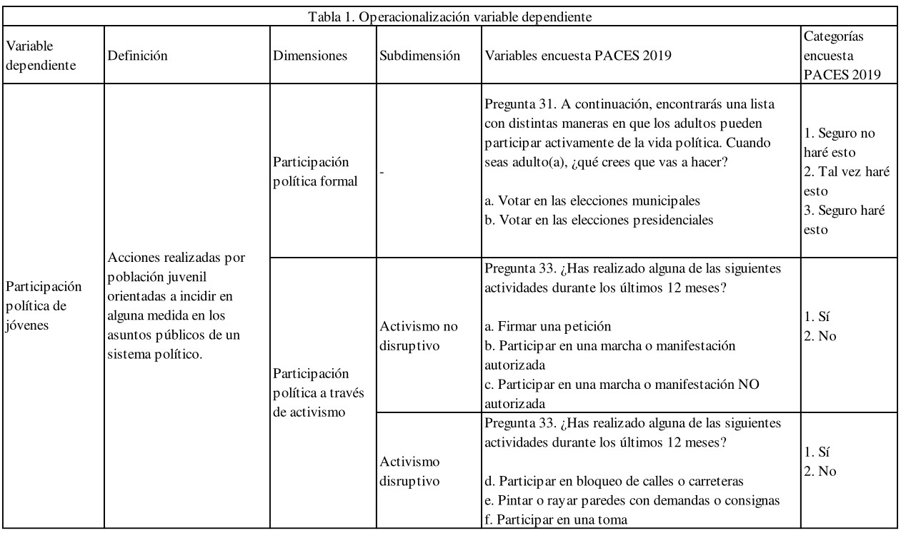
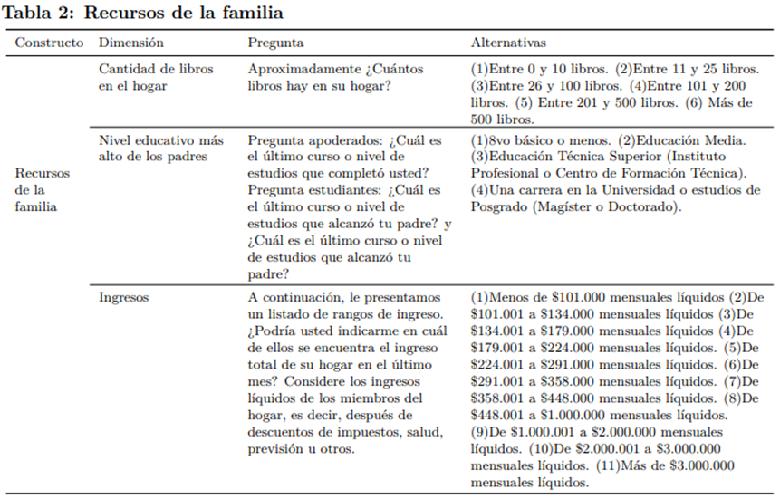
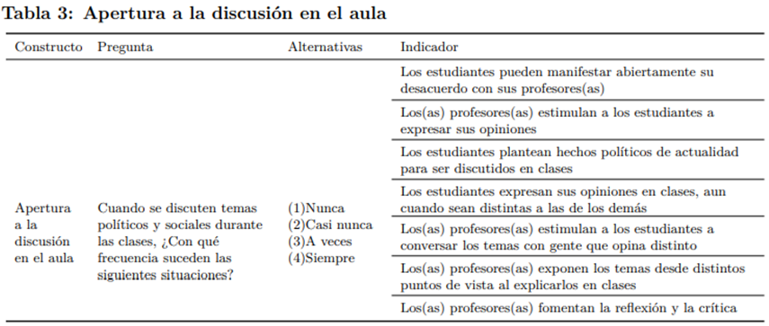

layout: true
class: animated, fadeIn

---
class: inverse, left, middle

# _Socialización política y educación para la ciudadanía el rol de la  familia y de la escuela.   .small[Avances de grupos de trabajo]_

***
[FONDECYT Regular 1181239](https://github.com/formacionciudadana)

 

#### Diciembre, 2020

---
class: center, middle

# _Grupos de trabajo_

---
### 1. Participación política

Daniel Miranda, Brian Montenegro y Karen Tapia 

### 2. Legitimidad democrática

Juan Carlos Castillo, Francisco Meneses y Martín Venegas

### 3. Tolerancia

Daniel Miranda, Anais Herrera y Kevin Carrasco

 

_**Coordinación:**_ Julio Iturra 

---
class: slideInRight, middle, inverse

***
# Participación
***

---

## Preguntas de Investigación
#### 1. ¿En qué medida la socialización política parental incide en la participación política de los jóvenes chilenos?
#### 2. ¿En qué medida la socialización política parental incide en la participación política de los jóvenes chilenos de distintos estratos socioeconómicos y de distintos niveles educativos?
#### 3. ¿Qué papel juega la escuela como mitigador o regulador de las desigualdades de origen en la participación política de los jóvenes chilenos?
---
## Variable dependiente - Participación Política Juvenil
#### Es un concepto que se define como las prácticas de jóvenes que buscan incidir en los asuntos públicos de un sistema político y de un país determinado (en este caso, de la democracia chilena). 

#### Éstas prácticas pueden ser colectivas o individuales, son voluntarias y buscan influenciar en la toma de decisiones de los agentes de los sistemas políticos (Almond & Verba, 1963; Parry et al., 1992; Pattie et al., 2004; Whiteley, 2012).

#### En la presente investigación, este concepto va a ser entendido como la participación política formal, participación política disruptiva y participación política no disruptiva. Respecto a la presentación anterior, se decidió no utilizar la categoría "participación política comunitaria".

---

---
## Hipótesis de socialización política familiar y escolar

##### H1. Se hipotetiza que las prácticas de socialización en el contexto familiar se traducen en mayores niveles de participación en jóvenes. Concretamente, jóvenes provenientes de familias con mayores prácticas de socialización política presentarán mayores niveles de participación cívica (intencionada/reportada) que aquellos jóvenes provenientes de familias con menores  prácticas de socialización política.

##### H2a. Jóvenes que crecen en familias con mayores recursos socioeconómicos y culturales presentarán mayores niveles de participación política formal y activista no disruptiva, respecto a aquellos jóvenes que provienen de familias que tienen menores recursos socioeconómicos y culturales

##### H2b. Jóvenes que crecen en familias con mayores recursos socioeconómicos y culturales  presentarán menores niveles de participación política activista disruptiva, respecto a aquellos jóvenes que provienen de familias que tienen menores recursos socioeconómicos y culturales.

---
## Hipótesis de socialización política familiar y escolar

##### H3a. Se hipotetiza que las prácticas de enseñanza orientadas a la formación ciudadana  se asocian con los niveles de participación de los jóvenes. Concretamente, jóvenes que asisten a escuelas con mayores prácticas de formación ciudadana presentarán mayores niveles de participación formal y activista no disruptiva. 

##### H3b. Se hipotetiza que espacios más abiertos a la discusión en el contexto escolar se asocian con los niveles de participación de los jóvenes. Concretamente, jóvenes que asisten a escuelas con mayor apertura a la discusión sobre temas sociales y políticos presentarán mayores niveles de participación formal y activista no disruptiva. 

---
## Hipótesis de socialización política escolar
##### H4a. Se hipotetiza que las prácticas de enseñanza orientadas a la formación ciudadana mitigaran las desigualdades políticas de origen de los/as estudiantes chilenos. Es decir, en aquellas escuelas que desarrollan más actividades de formación ciudadana la asociación entre los recursos socioeconómicos y culturales de la familia con los niveles de participación de los jóvenes será menos intensa, que en aquellas escuelas que desarrollan menos actividades de formación ciudadana.

##### H4b. Se hipotetiza que espacios más abiertos a la discusión en el contexto escolar mitigaran las desigualdades políticas de origen de los/as estudiantes chilenos. Es decir, en aquellas escuelas que hay mayor apertura a la discusión sobre temas sociales y políticos la asociación entre los recursos socioeconómicos y culturales de la familia con los niveles de participación de los jóvenes será menos intensa, que en aquellas escuelas que desarrollan menos actividades de formación ciudadana.

---
## Hipótesis de socialización política escolar

##### H5a. Se hipotetiza que las prácticas de enseñanza orientadas a la formación ciudadana mitigarán el efecto de las prácticas de socialización familiar sobre la participación de los jóvenes. Es decir, en aquellas escuelas que desarrollan más actividades de formación ciudadana la asociación entre los recursos socioeconómicos y culturales de la familia con los niveles de participación de los jóvenes será menos intensa, que en aquellas escuelas que desarrollan menos actividades de formación ciudadana, que en aquellas escuelas que desarrollan menos actividades de formación ciudadana.

##### H5b. Se hipotetiza que espacios más abiertos a la discusión en el contexto escolar mitigarán el efecto de las prácticas de socialización familiar sobre la participación de los jóvenes. Es decir, en aquellas escuelas que hay mayor apertura a la discusión sobre temas sociales y políticos la asociación entre los recursos socioeconómicos y culturales de la familia con los niveles de participación de los jóvenes será menos intensa, que en aquellas escuelas que desarrollan menos actividades de formación ciudadana.
---
class: center, middle

---
## Plan de Análisis
### 1. Análisis uni y bivariado de las variables de importancia para el estudio.
### 2. Análisis Factorial Confirmatorio (AFC) para ratificar -o modificar- la estructura interna de los conceptos medidos por más de una variable.
### 3. Modelo de ecuaciones estructurales multinivel para testear las principales hipótesis de la investigación.

---
class: slideInRight, middle, inverse

***
# Legitimidad
***
---
# Pre-registro: La socialización de la meritocracia: el efecto de la familia y la escuela
- ¿Se han recopilado ya datos para este estudio?
- ¿Cuál es la pregunta principal o la hipótesis que se está probando en este estudio?
- Describa la(s) variable(s) clave(s) especificando cómo se medirán.
- Especifique exactamente qué análisis se realizará para examinar la pregunta / hipótesis principal
- ¿Algún análisis secundario?
- ¿Cuántas observaciones se recopilarán o que determinará el tamaño de la muestra?
- ¿Algo más que le gustaría inscribirse? (por ejemplo, exclusiones de datos, variables recopiladas con fines exploratorios, análisis inusuales previstos)
---
# Pre-registro: La socialización de la meritocracia: el efecto de la familia y la escuela
- ¿Se han recopilado ya datos para este estudio?
- **¿Cuál es la pregunta principal o la hipótesis que se está probando en este estudio?**
- **Describa la(s) variable(s) clave(s) especificando cómo se medirán.**
- **Especifique exactamente qué análisis se realizará para examinar la pregunta / hipótesis principal**
- ¿Algún análisis secundario?
- ¿Cuántas observaciones se recopilarán o que determinará el tamaño de la muestra?
- ¿Algo más que le gustaría inscribirse? (por ejemplo, exclusiones de datos, variables recopiladas con fines exploratorios, análisis inusuales previstos)
---
# Sintesis grandes cambios

1. Reducción de la complejidad del modelo teórico

2. Foco en percepciones de meritocracia

3. Cambio de técnica de análisis

---
# Pregunta e hipótesis

**Pregunta:** ¿Cómo se relacionan las percepciones meritocráticas de estudiantes de 2do medio en Chile con el rol de la familia y la escuela?

**Objetivo:** Analizar las percepciones meritocraticas de estudiantes de 2do medio en Chile en relación a dos agentes de socialización: la familia y la escuela.

**Hipótesis:**
- $H_1$ Padres con mayor percepción de meritocracia fomentan en sus hijos una mayor percepción de meritocracia.
- $H_2$. Los estudiantes que sienten que obtienen calificaciones justas en sus colegios poseen mayor percepción de meritocracia.
- $H_3$. El efecto de la percepción de meritocracia de los padres sobre la percepción de meritocracia de los estudiantes se verá moderado por su sentido de justicia en las notas.
---
# Descripción de variables

.center[]

**Percepción de meritocracia:** Constatación u observación personal sobre el funcionamiento de la meritocracia en la sociedad, entendida como que los recursos se distribuyen en base a mérito (esfuerzo y talento).

**Sentido de justicia en la escuela:** Brecha de justicia en la distribución de notas en la escuela
---

# Descripción de variables
## Forma de medición
**Percepción de meritocracia:** Se mantiene la medición original. Escala Likert de 4 categorías para cada indicador.  

**Sentido de justicia en la escuela:** Logaritmo natural de la proporción entre la recompensa obtenida y la recompensa justa, en este caso las notas

$\text{Sentido de justicia en notas}= ln(\frac{\text{nota obtenida}}{\text{nota esperada}})$

---
# Análisis
En vista de la estructura jerarquizada de la base de datos y considerando el nivel de medición ordinal de las variables se utilizarán *regresiones logísticas ordinales multinivel*. El modelo general se puede formalizar de la siguiente forma:

$log\left(\frac{Pr(Y_{ij}≤c)}{Pr(Y_{ij}>c)}\right)= a_c+\gamma_{1}Perc.MeritocraciaPadres_{ij}*\gamma_2SentidoJusticiaNotas_{ij}$
$+\gamma_nControles_{ij}+u_{j}$

El modelo general representa el cálculo de la probabilidad acumulada de que un estudiante responda hasta una categoría $C$ de la escala Likert en los indicadores de percepción de meritocracia. Por ejemplo, que un estudiante responda hasta *muy de acuerdo* acerca de la importancia del trabajo duro.
---
# Análisis
## Pasos
La construcción del modelo general se hará por partes.
--

- *Modelo 1:* solamente incluirá el coeficiente $\gamma_1$ para la percepción meritocrática de los padres.

--
- *Modelo 2:* se añadirá $\gamma_2$ para controlar por el sentido de justicia en las notas.

--

- *Modelo 3 (general)*: se añade $\gamma_n$ para los controles y la interacción $\gamma_1*\gamma_2$. Este procedimiento se realizará para cada indicador de la percepción meritocrática de los estudiantes.

---

class: slideInRight, middle, inverse
***
# Propuestas
***

---
# Modelo Actual

---
# Propuesta

> H1: La percepción meritocratica de los padres media en parte el efecto del nivel socioeconomico sobre la percepción meritocratica. 

---
class: slideInRight, middle, inverse

***
# Tolerancia
***

---

# Introducción
* 
Reorientación del estudio: Enfoque en la igualdad de género. 

* 
Siguiendo la definición de la UNESCO, “Por “igualdad de género” se entiende la existencia de una igualdad de oportunidades y de derechos entre las mujeres y los hombres en las esferas privada y pública que les brinde y garantice la posibilidad de realizar la vida que deseen." (UNESCO, n.d., p. 104). 

---
# Variables centrales
.center[]

---
# Variables centrales
.center[]

---
# Variables centrales
.center[]

---
# Variables centrales

---
# Hipótesis
* 
 H1 : Se anticipa que mayores recursos familiares se traducen en mejores actitudes de los jóvenes hacia la igualdad de género. En otras palabras, se espera que los jóvenes provenientes de familias con mayores recursos presentarán actitudes más positivas hacia la igualdad de género que sus pares provenientes de familias con menores recursos. 

* 
 H2 : Se anticipa que las actitudes hacia la igualdad de género serán transmitidas intergeneracionalmente. En otras palabras, se espera que los jóvenes provenientes de familias con apoderados que poseen actitudes positivas hacia la igualdad de género presentarán actitudes más positivas hacia la igualdad de género que sus pares con apoderados que poseen actitudes negativas hacia la igualdad de género. 

---
# Hipótesis
* 
 H3 : Se anticipa que mayores recursos familiares se traducen en mejores actitudes de los apoderados hacia la igualdad de género. En otras palabras, se espera que los apoderados con mayores recursos presentarán actitudes más positivas hacia la igualdad de género que los apoderados con menores recursos. 

* 
 H3a: Se anticipa que la relación entre los recursos familiares y las actitudes de los jóvenes hacia la igualdad de género estará mediada por las actitudes de los apoderados hacia la igualdad de género. En otras palabras, se espera que los recursos familiares se relacionen de manera indirecta con las actitudes de los jóvenes hacia la igualdad de género, a través de las actitudes de los apoderados hacia la igualdad de género. 

---
# Hipótesis
* 
 H4a: Se anticipa que mayores niveles de diversidad en el aula se traducen en mejores actitudes de los jóvenes hacia la igualdad de género. En otras palabras, se espera que los jóvenes pertenecientes a escuelas con altos niveles de diversidad en el aula presentarán actitudes más positivas hacia la igualdad de género que sus pares pertenecientes a escuelas con bajos niveles de diversidad en el aula 

* 
 H4b: Se anticipa que mayores niveles de apertura a la discusión en el aula se traducen en mejores actitudes de los jóvenes hacia la igualdad de género. En otras palabras, se espera que los jóvenes pertenecientes a escuelas donde la mayoría de los estudiantes siente que hay un clima de aula abierto a la discusión presentarán actitudes más positivas hacia la igualdad de género que sus pares pertenecientes a escuelas donde la mayoría de los estudiantes siente que no hay un clima de aula abierto a la discusión. 

---
# Hipótesis
* 
 H5a: Se anticipa que la asociación entre los recursos de la familia y las actitudes del estudiante hacia la igualdad de género estará moderada o condicionada por la diversidad en el aula. Más precisamente, se espera que en escuelas donde se observa mayor diversidad el vínculo entre los recursos de la familia y las actitudes de los hijos será más tenue que en escuelas donde se observan menores niveles de diversidad en el aula. 

* 
 H5b: Se anticipa que la asociación entre los recursos de la familia y las actitudes del estudiante hacia la igualdad de género estará moderada o condicionada por la apertura a la discusión en el aula. Más precisamente, se espera que en escuelas donde se observa mayor apertura a la discusión el vínculo entre los recursos de la familia y las actitudes de los hijos será más tenue que en escuelas donde se observan menores niveles de diversidad en el aula. 

---
# Hipótesis
* 
 H6a: Se anticipa que la asociación entre las actitudes de padres e hijos hacia la igualdad de género estará moderada o condicionada por la diversidad en el aula. Más precisamente, se espera que en escuelas donde se observa mayor diversidad el vínculo entre las actitudes de los padres y las actitudes de los hijos será más tenue que en escuelas donde se observan menores niveles de diversidad en el aula. 

* 
 H6b: Se anticipa que la asociación entre las actitudes de padres e hijos hacia la igualdad de género estará moderada o condicionada por la apertura a la discusión en el aula. Más precisamente, se espera que en escuelas donde se observa mayor apertura a la discusión el vínculo entre las actitudes de los padres y de los hijos será más tenue que en escuelas donde se observan menores niveles de diversidad en el aula. 

---
# Plan de análisis
* 
 Análisis factorial confirmatorio: Este análisis se realizará tanto para la variable dependiente (con los datos de los estudiantes), como para la variable independiente referida a las actitudes de los apoderados hacia la igualdad de género. Los indicadores se agruparán en tres dimensiones: a) la igualdad de derechos entre hombres y mujeres en general; b) la igualdad de género y la distribución del poder en el espacio público; y c) la igualdad de género y la distribución del poder en el espacio privado. 

* 
 Análisis descriptivos de todas las variables y análisis correlacionales para evaluar las asociaciones correspondientes a las hipótesis 1, 2, 3 y 4. 

---
# Plan de análisis
* 
 Regresiones multinivel para probar las hipótesis siguiendo los pasos recomendados para este tipo de modelos (Aguinis et al., 2013). 

Hay cuatro tipos de hipótesis a testear: 
* 
 1. Hipótesis de efectos directos a nivel individual (1, 2 y 3). 

* 
 2. Hipótesis de efectos directos a nivel agregado (4). 

* 
 3. Hipótesis de mediación (3a).

* 
 4. Hipótesis de moderación (5 y 6). 

---
class: middle, center

#`r  fontawesome::fa(name = "github", fill = "black")`   [github.com/formacionciudadana](https://github.com/formacionciudadana)

