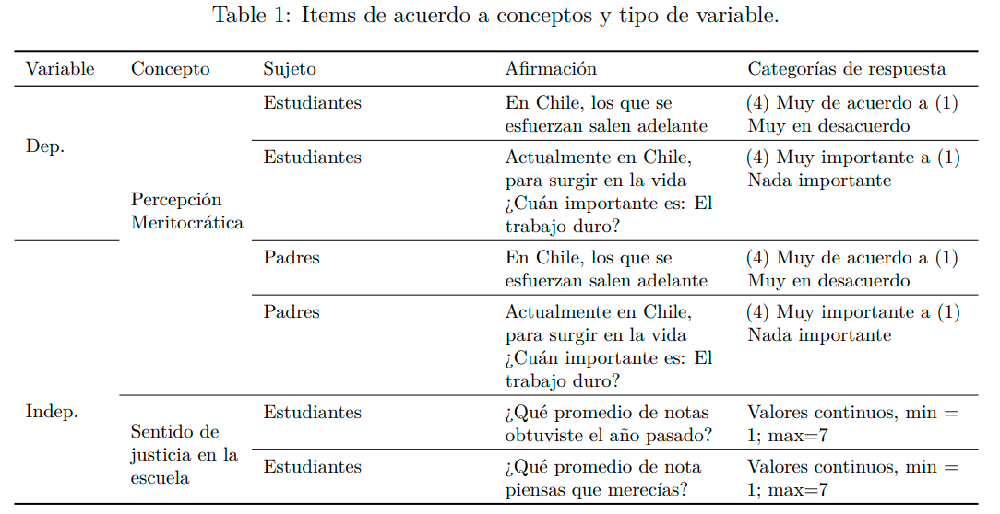

class: slideInRight, middle, inverse
***
# Legitimidad
***
---
# Pre-registro: La socialización de la meritocracia: el efecto de la familia y la escuela
- ¿Se han recopilado ya datos para este estudio?
- ¿Cuál es la pregunta principal o la hipótesis que se está probando en este estudio?
- Describa la(s) variable(s) clave(s) especificando cómo se medirán.
- Especifique exactamente qué análisis se realizará para examinar la pregunta / hipótesis principal
- ¿Algún análisis secundario?
- ¿Cuántas observaciones se recopilarán o que determinará el tamaño de la muestra?
- ¿Algo más que le gustaría inscribirse? (por ejemplo, exclusiones de datos, variables recopiladas con fines exploratorios, análisis inusuales previstos)
---
# Pre-registro: La socialización de la meritocracia: el efecto de la familia y la escuela
- ¿Se han recopilado ya datos para este estudio?
- **¿Cuál es la pregunta principal o la hipótesis que se está probando en este estudio?**
- **Describa la(s) variable(s) clave(s) especificando cómo se medirán.**
- **Especifique exactamente qué análisis se realizará para examinar la pregunta / hipótesis principal**
- ¿Algún análisis secundario?
- ¿Cuántas observaciones se recopilarán o que determinará el tamaño de la muestra?
- ¿Algo más que le gustaría inscribirse? (por ejemplo, exclusiones de datos, variables recopiladas con fines exploratorios, análisis inusuales previstos)
---
# Sintesis grandes cambios

1. Reducción de la complejidad del modelo teórico

2. Foco en percepciones de meritocracia

3. Cambio de técnica de análisis

---
# Pregunta e hipótesis

**Pregunta:** ¿Cómo se relacionan las percepciones meritocráticas de estudiantes de 2do medio en Chile con el rol de la familia y la escuela?

**Objetivo:** Analizar las percepciones meritocraticas de estudiantes de 2do medio en Chile en relación a dos agentes de socialización: la familia y la escuela.

**Hipótesis:**
- $H_1$ Padres con mayor percepción de meritocracia fomentan en sus hijos una mayor percepción de meritocracia.
- $H_2$. Los estudiantes que sienten que obtienen calificaciones justas en sus colegios poseen mayor percepción de meritocracia.
- $H_3$. El efecto de la percepción de meritocracia de los padres sobre la percepción de meritocracia de los estudiantes se verá moderado por su sentido de justicia en las notas.
---
# Descripción de variables

**Percepción de meritocracia:** Constatación u observación personal sobre el funcionamiento de la meritocracia en la sociedad, entendida como que los recursos se distribuyen en base a mérito (esfuerzo y talento).

**Sentido de justicia en la escuela:** Brecha de justicia en la distribución de notas en la escuela
---

# Descripción de variables
## Forma de medición
**Percepción de meritocracia:** Se mantiene la medición original. Escala Likert de 4 categorías para cada indicador.  

**Sentido de justicia en la escuela:** Logaritmo natural de la proporción entre la recompensa obtenida y la recompensa justa, en este caso las notas

$\text{Sentido de justicia en notas}= ln(\frac{\text{nota obtenida}}{\text{nota esperada}})$

---
# Análisis
En vista de la estructura jerarquizada de la base de datos y considerando el nivel de medición ordinal de las variables se utilizarán *regresiones logísticas ordinales multinivel*. El modelo general se puede formalizar de la siguiente forma:

$log\left(\frac{Pr(Y_{ij}≤c)}{Pr(Y_{ij}>c)}\right)= a_c+\gamma_{1}Perc.MeritocraciaPadres_{ij}*\gamma_2SentidoJusticiaNotas_{ij}$
$+\gamma_nControles_{ij}+u_{j}$

El modelo general representa el cálculo de la probabilidad acumulada de que un estudiante responda hasta una categoría $C$ de la escala Likert en los indicadores de percepción de meritocracia. Por ejemplo, que un estudiante responda hasta *muy de acuerdo* acerca de la importancia del trabajo duro.
---
# Análisis
## Pasos
La construcción del modelo general se hará por partes.
--

- *Modelo 1:* solamente incluirá el coeficiente $\gamma_1$ para la percepción meritocrática de los padres.

--
- *Modelo 2:* se añadirá $\gamma_2$ para controlar por el sentido de justicia en las notas.

--

- *Modelo 3 (general)*: se añade $\gamma_n$ para los controles y la interacción $\gamma_1*\gamma_2$. Este procedimiento se realizará para cada indicador de la percepción meritocrática de los estudiantes.

---

class: slideInRight, middle, inverse
***
# Propuestas
***

---
# Modelo Actual

---
# Propuesta

> H1: La percepción meritocratica de los padres media en parte el efecto del nivel socioeconomico sobre la percepción meritocratica. 

---

class: inverse, center
# ¡Muchas gracias!
---