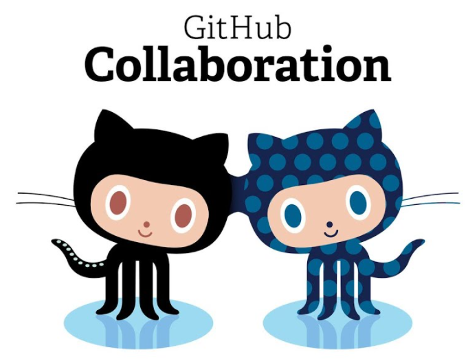
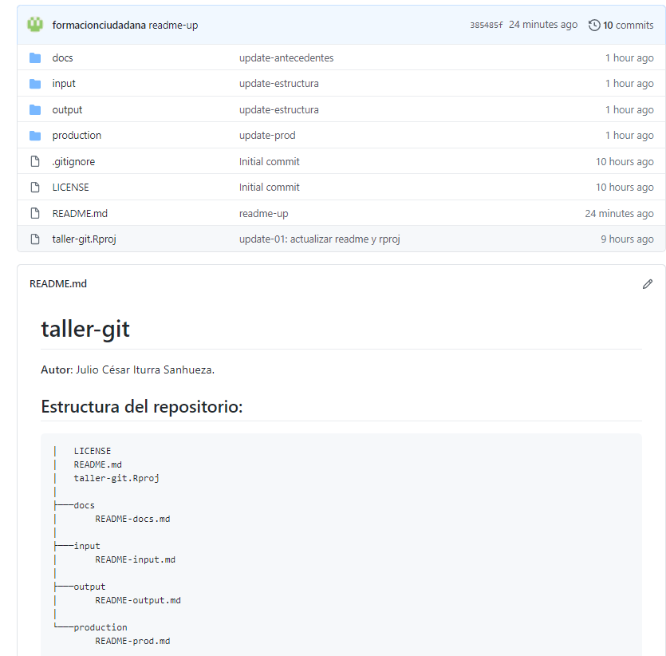

layout: true
class: animated, fadeIn

---
class: inverse, left, middle

# _Trabajo colaborativo y control de versiones usando GitHub._


Julio César Iturra Sanhueza $^1$

***
[FONDECYT Regular 1181239](https://github.com/formacionciudadana)

<br>

#### Enero, 2021
##### $^1$ Centro de Estudios de Conflicto y Cohesión Social


---
# Contenidos de la sesión

1. Conceptos centrales

2. Trabajo colaborativo

3. Repositorios: remote y local   

4. Clone, Branch, Commit, Push... pull request (?)

5. Ejercicio práctico

---
class: middle, center
# _Conceptos Centrales_ 

---

# Control de versiones


.left-column[ 
.center[]
.center[**Existen control de versiones** ]
]


.left-column[]


---
# Control de versiones

.left-column[ 
.center[]
.center[**¡Y control de versiones!** ]
]

.left-column[]

---
# Control de versiones

* Un flujo de trabajo basado en **Git** facilita:
  
  1. Control sobre versiones de uno o más documentos.
  2. Observar "pasado y presente" de un proyecto completo.
  2. Apertura y transparencia (repositorios).
  3. **Trabajo Colaborativo**
  
---
# Colaboración

.left-column[

* Una de las ventajas de trabajar en un marco basado en Git es que podemos colaborar con diferentes personas dentro de un **mismo proyecto**. (p.ej. tutor-estudiante, equipo de trabajo, etc)

* Controlar qué es lo que _cambia_ y qué es lo que se _conserva_.

* **Aceptar** o **rechazar** cambios surgeridos por otr-s usuari-s 


]

.right-column[ ]

---
# Repositorios: remote y local


> **Repositorio**: Un directorio o espacio de almacenamiento donde pueden _vivir_ sus proyectos. A veces los usuarios de GitHub acortan esto a "repo". 

> Puede ser local a una carpeta de tu ordenador, o puede ser un espacio de almacenamiento en GitHub o en otro host online. Puedes guardar archivos de código, de texto, de imagen, lo que quieras, dentro de un repositorio.


.center[
]

---

**Clone**: Se utiliza para apuntar a un repositorio existente y crear un clon, o una copia del repositorio de destino. 

**Branch**: Una "branch" representa una línea independiente de trabajo. Las _branches_ sirven como una abstracción de los procesos de cambio, preparación y confirmación.

**Commit**: Una confirmación, o "revisión", es un cambio individual en un archivo (o conjunto de archivos). Con Git, cada vez que lo guardas se crea un ID único (también conocido como "SHA" o "hash") que te permite llevar un registro de qué cambios se hicieron cuándo y por quién.

**Push**: El comando "push" se usa para publicar nuevos commits locales en un servidor remoto.

**Fetch**: El comando "fetch" descarga commits, archivos y referencias de un repositorio remoto a tu repositorio local. "Fetch" es lo que haces cuando quieres ver en qué han estado trabajando los demás.


**Pull**: Se usa para recuperar y descargar contenido de un repositorio remoto e inmediatamente actualizar el repositorio local para que coincida con ese contenido. 

---

.center[]

---
**Pull request**: Son una característica específica de `GitHub.` Proporcionan una forma simple, basada en la web, de enviar tus cambios. En concreto, es pedirle al proyecto (main-branch) que extraiga los cambios de tu branch.

.center[]


---
# Propuesta de trabajo colaborativo


* En esta sección se presentará una propuesta de trabajo basada en branches independientes para cada tarea. Para ello, nos hemos basado en la estructura de proyectos usando el protocolo [**IPO** (Input- Procesamiento-Output)](https://cienciasocialabierta.netlify.app/class/06-class/).

.left-column[]

.right-column[
1. Branch para _**metodos**_ donde se pueden registrar procedimientos como la preparación y análisis de datos.
2. Branch para _**antecedentes**_ donde se pueden registrar todos los procedimientos referidos a revisión de literatura y escritura.
]


---
# El repositorio 


.left-column[,
.center[[formacionciudadana/taller-git](https://github.com/formacionciudadana/taller-git)]
]

.right-column[

**Estructura de carpetas y archivos**
```{r eval=FALSE, include=TRUE}
│   LICENSE
│   README.md
│   taller-git.Rproj
│
├───docs
│       README-docs.md
│
├───input
│       README-input.md
│
├───output
│       README-output.md
│
└───production
        README-prod.md
```
]
 

---
class:middle, center
<iframe height="650" width="1200" frameborder="no" src="https://viewer.diagrams.net/?highlight=0000ff&edit=_blank&layers=1&nav=1&title=flujo-repos.drawio#Uhttps%3A%2F%2Fdrive.google.com%2Fuc%3Fid%3D1qdR28bRdakH_MztuTuXOh8qDmquDjJmN%26export%3Ddownload">
</iframe>

---
# Práctica

1. Clonar el repositorio [formacionciudadana/taller-git](https://github.com/formacionciudadana/taller-git.git) localmente usando RStudio.
2. Seleccionar una branch  (metodos o antecedentes)
3. Crear un archivo .Rmd para cada una de las branches
  * `metodos.Rmd`
  * `antecedentes.Rmd`
4. Lograr 'guardar' cambios a través de un commit en su branch respectiva
5. Realizar push hacia el repositorio remoto (en GitHub)
6. Pull Request $\rightarrow$ main (remote)

---
# Algunos tips de configuración 

En RStudio:

> Tools $\rightarrow$ Terminal $\rightarrow$ New Terminal (`Alt+Shift+R`)

```{r eval=FALSE, include=TRUE}
git config --global user.email "fondecyt.ciudadania@gmail.com" 
git config --global user.name "formacionciudadana"
```

---
class: middle, center

### `r  fontawesome::fa(name = "github", fill = "black")` <br> [github.com/jciturras](https://github.com/jciturras) 

### [github.com/formacionciudadana](https://github.com/formacionciudadana)


