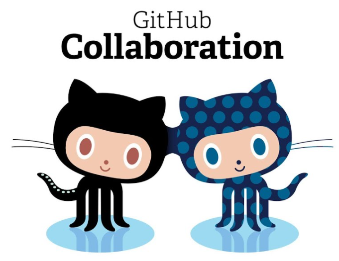

layout: true
class: animated, fadeIn

---
class: inverse, left, middle

# _Trabajo colaborativo y control de versiones usando GitHub._


Julio César Iturra Sanhueza $^1$

***
[FONDECYT Regular 1181239](https://github.com/formacionciudadana)

<br>

#### Enero, 2021
##### $^1$ Centro de Estudios de Conflicto y Cohesión Social


---
# Contenidos de la sesión.

1. Conceptos centrales

2. Trabajo colaborativo

3. Repositorios: remote y local   

4. Clone, Branch, Commit, Push... pull request (?)

5. Ejercicio práctico

---
class: middle, center
# _Conceptos Centrales_ 

---

# Control de versiones


.left-column[ 
.center[]
.center[**Existen control de versiones** ]
]


.left-column[]


---
# Control de versiones

.left-column[ 
.center[]
.center[**¡Y control de versiones!** ]
]

.left-column[]

---
# Control de versiones

* Un flujo de trabajo basado en **Git** facilita:
  
  1. Control sobre versiones de uno o más documentos.
  2. Observar "pasado y presente" de un proyecto completo.
  2. Apertura y transparencia (repositorios).
  3. **Trabajo Colaborativo**
  
---
# Colaboración

.left-column[

* Una de las ventajas de trabajar en un marco basado en Git es que podemos colaborar con diferentes personas dentro de un **mismo proyecto**. (p.ej. tutor-estudiante, equipo de trabajo, etc)

* Controlar qué es lo que _cambia_ y qué es lo que se _conserva_.

* **Aceptar** o **rechazar** cambios surgeridos por otr-s usuari-s 


]

.right-column[ ]

---
# Repositorios: remote y local


> **Repositorio**: Un directorio o espacio de almacenamiento donde pueden _vivir_ sus proyectos. A veces los usuarios de GitHub acortan esto a "repo". 

> Puede ser local a una carpeta de tu ordenador, o puede ser un espacio de almacenamiento en GitHub o en otro host online. Puedes guardar archivos de código, de texto, de imagen, lo que quieras, dentro de un repositorio.


.center[
]

---

**Clone**: Se utiliza para apuntar a un repositorio existente y crear un clon, o una copia del repositorio de destino. 

**Branch**: Una "branch" representa una línea independiente de trabajo. Las _branches_ sirven como una abstracción de los procesos de cambio, preparación y confirmación.

**Commit**: Una confirmación, o "revisión", es un cambio individual en un archivo (o conjunto de archivos). Con Git, cada vez que lo guardas se crea un ID único (también conocido como "SHA" o "hash") que te permite llevar un registro de qué cambios se hicieron cuándo y por quién.

**Push**: El comando "push" se usa para publicar nuevos commits locales en un servidor remoto.

**Fetch**: El comando "fetch" descarga commits, archivos y referencias de un repositorio remoto a tu repositorio local. "Fetch" es lo que haces cuando quieres ver en qué han estado trabajando los demás.


**Pull**: Se usa para recuperar y descargar contenido de un repositorio remoto e inmediatamente actualizar el repositorio local para que coincida con ese contenido. 

---

.center[]

---
**Pull request**: Son una característica específica de `GitHub.` Proporcionan una forma simple, basada en la web, de enviar tus cambios. En concreto, es pedirle al proyecto (main-branch) que extraiga los cambios de tu branch.

.center[]


---
# Propuesta de trabajo colaborativo


* En esta sección se presentará una propuesta de trabajo basada en branches independientes para cada tarea. Para ello, nos hemos basado en la estructura de proyectos usando el protocolo [**IPO** (Input- Procesamiento-Output)](https://cienciasocialabierta.netlify.app/class/06-class/).

.left-column[]

.right-column[
1. Branch para _**metodos**_ donde se pueden registrar procedimientos como la preparación y análisis de datos.
2. Branch para _**antecedentes**_ donde se pueden registrar todos los procedimientos referidos a revisión de literatura y escritura.
]


---
# El repositorio 


.left-column[,
.center[[formacionciudadana/taller-git](https://github.com/formacionciudadana/taller-git)]
]

.right-column[

**Estructura de carpetas y archivos**

```r
│   LICENSE
│   README.md
│   taller-git.Rproj
│
├───docs
│       README-docs.md
│
├───input
│       README-input.md
│
├───output
│       README-output.md
│
└───production
        README-prod.md
```
]
 

---
class:middle, center
<iframe height="650" width="1200" frameborder="no" src="https://viewer.diagrams.net/?highlight=0000ff&edit=_blank&layers=1&nav=1&title=flujo-repos.drawio#Uhttps%3A%2F%2Fdrive.google.com%2Fuc%3Fid%3D1qdR28bRdakH_MztuTuXOh8qDmquDjJmN%26export%3Ddownload">
</iframe>

---
# Práctica

1. Clonar el repositorio [formacionciudadana/taller-git](https://github.com/formacionciudadana/taller-git.git) localmente usando RStudio.
2. Seleccionar una branch  (metodos o antecedentes)
3. Crear un archivo .Rmd para cada una de las branches
  * `metodos.Rmd`
  * `antecedentes.Rmd`
4. Lograr 'guardar' cambios a través de un commit en su branch respectiva
5. Realizar push hacia el repositorio remoto (en GitHub)
6. Pull Request $\rightarrow$ main (remote)

---
# Algunos tips de configuración 

En RStudio:

> Tools $\rightarrow$ Terminal $\rightarrow$ New Terminal (`Alt+Shift+R`)


```r
git config --global user.email "fondecyt.ciudadania@gmail.com" 
git config --global user.name "formacionciudadana"
```

---
class: middle, center

### <svg style="height:0.8em;top:.04em;position:relative;fill:black;" viewBox="0 0 496 512"><path d="M165.9 397.4c0 2-2.3 3.6-5.2 3.6-3.3.3-5.6-1.3-5.6-3.6 0-2 2.3-3.6 5.2-3.6 3-.3 5.6 1.3 5.6 3.6zm-31.1-4.5c-.7 2 1.3 4.3 4.3 4.9 2.6 1 5.6 0 6.2-2s-1.3-4.3-4.3-5.2c-2.6-.7-5.5.3-6.2 2.3zm44.2-1.7c-2.9.7-4.9 2.6-4.6 4.9.3 2 2.9 3.3 5.9 2.6 2.9-.7 4.9-2.6 4.6-4.6-.3-1.9-3-3.2-5.9-2.9zM244.8 8C106.1 8 0 113.3 0 252c0 110.9 69.8 205.8 169.5 239.2 12.8 2.3 17.3-5.6 17.3-12.1 0-6.2-.3-40.4-.3-61.4 0 0-70 15-84.7-29.8 0 0-11.4-29.1-27.8-36.6 0 0-22.9-15.7 1.6-15.4 0 0 24.9 2 38.6 25.8 21.9 38.6 58.6 27.5 72.9 20.9 2.3-16 8.8-27.1 16-33.7-55.9-6.2-112.3-14.3-112.3-110.5 0-27.5 7.6-41.3 23.6-58.9-2.6-6.5-11.1-33.3 2.6-67.9 20.9-6.5 69 27 69 27 20-5.6 41.5-8.5 62.8-8.5s42.8 2.9 62.8 8.5c0 0 48.1-33.6 69-27 13.7 34.7 5.2 61.4 2.6 67.9 16 17.7 25.8 31.5 25.8 58.9 0 96.5-58.9 104.2-114.8 110.5 9.2 7.9 17 22.9 17 46.4 0 33.7-.3 75.4-.3 83.6 0 6.5 4.6 14.4 17.3 12.1C428.2 457.8 496 362.9 496 252 496 113.3 383.5 8 244.8 8zM97.2 352.9c-1.3 1-1 3.3.7 5.2 1.6 1.6 3.9 2.3 5.2 1 1.3-1 1-3.3-.7-5.2-1.6-1.6-3.9-2.3-5.2-1zm-10.8-8.1c-.7 1.3.3 2.9 2.3 3.9 1.6 1 3.6.7 4.3-.7.7-1.3-.3-2.9-2.3-3.9-2-.6-3.6-.3-4.3.7zm32.4 35.6c-1.6 1.3-1 4.3 1.3 6.2 2.3 2.3 5.2 2.6 6.5 1 1.3-1.3.7-4.3-1.3-6.2-2.2-2.3-5.2-2.6-6.5-1zm-11.4-14.7c-1.6 1-1.6 3.6 0 5.9 1.6 2.3 4.3 3.3 5.6 2.3 1.6-1.3 1.6-3.9 0-6.2-1.4-2.3-4-3.3-5.6-2z"/></svg> <br> [github.com/jciturras](https://github.com/jciturras) 

### [github.com/formacionciudadana](https://github.com/formacionciudadana)


