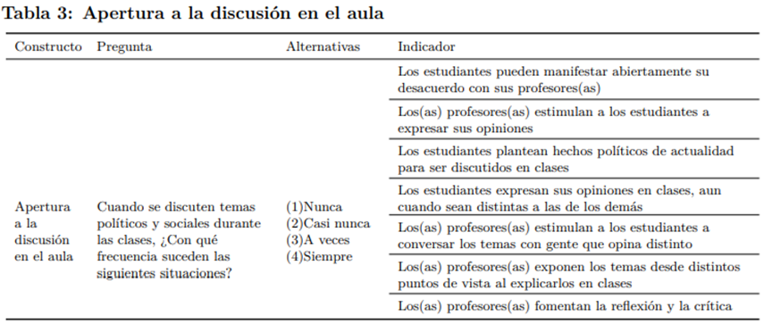

# Introducción
* 
Reorientación del estudio: Enfoque en la igualdad de género. 

* 
Siguiendo la definición de la UNESCO, “Por “igualdad de género” se entiende la existencia de una igualdad de oportunidades y de derechos entre las mujeres y los hombres en las esferas privada y pública que les brinde y garantice la posibilidad de realizar la vida que deseen." (UNESCO, n.d., p. 104). 

---
# Variables centrales

---
# Variables centrales

---
# Variables centrales

---
# Variables centrales

---
# Hipótesis
* 
 H1 : Se anticipa que mayores recursos familiares se traducen en mejores actitudes de los jóvenes hacia la igualdad de género. En otras palabras, se espera que los jóvenes provenientes de familias con mayores recursos presentarán actitudes más positivas hacia la igualdad de género que sus pares provenientes de familias con menores recursos. 

* 
 H2 : Se anticipa que las actitudes hacia la igualdad de género serán transmitidas intergeneracionalmente. En otras palabras, se espera que los jóvenes provenientes de familias con apoderados que poseen actitudes positivas hacia la igualdad de género presentarán actitudes más positivas hacia la igualdad de género que sus pares con apoderados que poseen actitudes negativas hacia la igualdad de género. 

---
# Hipótesis
* 
 H3 : Se anticipa que mayores recursos familiares se traducen en mejores actitudes de los apoderados hacia la igualdad de género. En otras palabras, se espera que los apoderados con mayores recursos presentarán actitudes más positivas hacia la igualdad de género que los apoderados con menores recursos. 

* 
 H3a: Se anticipa que la relación entre los recursos familiares y las actitudes de los jóvenes hacia la igualdad de género estará mediada por las actitudes de los apoderados hacia la igualdad de género. En otras palabras, se espera que los recursos familiares se relacionen de manera indirecta con las actitudes de los jóvenes hacia la igualdad de género, a través de las actitudes de los apoderados hacia la igualdad de género. 

---
# Hipótesis
* 
 H4a: Se anticipa que mayores niveles de diversidad en el aula se traducen en mejores actitudes de los jóvenes hacia la igualdad de género. En otras palabras, se espera que los jóvenes pertenecientes a escuelas con altos niveles de diversidad en el aula presentarán actitudes más positivas hacia la igualdad de género que sus pares pertenecientes a escuelas con bajos niveles de diversidad en el aula 

* 
 H4b: Se anticipa que mayores niveles de apertura a la discusión en el aula se traducen en mejores actitudes de los jóvenes hacia la igualdad de género. En otras palabras, se espera que los jóvenes pertenecientes a escuelas donde la mayoría de los estudiantes siente que hay un clima de aula abierto a la discusión presentarán actitudes más positivas hacia la igualdad de género que sus pares pertenecientes a escuelas donde la mayoría de los estudiantes siente que no hay un clima de aula abierto a la discusión. 

---
# Hipótesis
* 
 H5a: Se anticipa que la asociación entre los recursos de la familia y las actitudes del estudiante hacia la igualdad de género estará moderada o condicionada por la diversidad en el aula. Más precisamente, se espera que en escuelas donde se observa mayor diversidad el vínculo entre los recursos de la familia y las actitudes de los hijos será más tenue que en escuelas donde se observan menores niveles de diversidad en el aula. 

* 
 H5b: Se anticipa que la asociación entre los recursos de la familia y las actitudes del estudiante hacia la igualdad de género estará moderada o condicionada por la apertura a la discusión en el aula. Más precisamente, se espera que en escuelas donde se observa mayor apertura a la discusión el vínculo entre los recursos de la familia y las actitudes de los hijos será más tenue que en escuelas donde se observan menores niveles de diversidad en el aula. 

---
# Hipótesis
* 
 H6a: Se anticipa que la asociación entre las actitudes de padres e hijos hacia la igualdad de género estará moderada o condicionada por la diversidad en el aula. Más precisamente, se espera que en escuelas donde se observa mayor diversidad el vínculo entre las actitudes de los padres y las actitudes de los hijos será más tenue que en escuelas donde se observan menores niveles de diversidad en el aula. 

* 
 H6b: Se anticipa que la asociación entre las actitudes de padres e hijos hacia la igualdad de género estará moderada o condicionada por la apertura a la discusión en el aula. Más precisamente, se espera que en escuelas donde se observa mayor apertura a la discusión el vínculo entre las actitudes de los padres y de los hijos será más tenue que en escuelas donde se observan menores niveles de diversidad en el aula. 

---
# Plan de análisis
* 
 Análisis factorial confirmatorio: Este análisis se realizará tanto para la variable dependiente (con los datos de los estudiantes), como para la variable independiente referida a las actitudes de los apoderados hacia la igualdad de género. Los indicadores se agruparán en tres dimensiones: a) la igualdad de derechos entre hombres y mujeres en general; b) la igualdad de género y la distribución del poder en el espacio público; y c) la igualdad de género y la distribución del poder en el espacio privado. 

* 
 Análisis descriptivos de todas las variables y análisis correlacionales para evaluar las asociaciones correspondientes a las hipótesis 1, 2, 3 y 4. 

---
# Plan de análisis
* 
 Regresiones multinivel para probar las hipótesis siguiendo los pasos recomendados para este tipo de modelos (Aguinis et al., 2013). 

Hay cuatro tipos de hipótesis a testear: 
* 
 1. Hipótesis de efectos directos a nivel individual (1, 2 y 3). 

* 
 2. Hipótesis de efectos directos a nivel agregado (4). 

* 
 3. Hipótesis de mediación (3a).

* 
 4. Hipótesis de moderación (5 y 6). 
